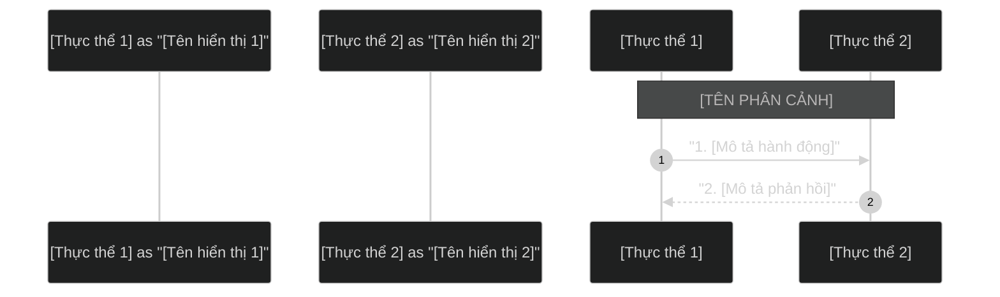

# Skill Vẽ Sơ Đồ Hệ Thống & Trực Quan Hóa (Diagram Drawer)

Skill này hướng dẫn chi tiết cách thiết kế sơ đồ dạng Mermaid (đặc biệt là Sequence Diagram) theo chuẩn giao diện nền tối (Dark Theme), xuất ra ảnh PNG/SVG chất lượng cao và trình bày tài liệu theo đúng cấu trúc template chuẩn của dự án.

---

## 1. Nguyên Tắc Thiết Kế Sơ Đồ Mermaid

Khi viết code Mermaid cho Sequence Diagram, luôn tuân thủ các quy tắc sau để đảm bảo sơ đồ trực quan và không bị lỗi biên dịch:

### A. Cấu Hình Theme Tối (Dark Theme)
Luôn đặt chỉ thị cấu hình theme tối ở ngay dòng đầu tiên của khối code Mermaid:
```mermaid
%%{init: { 'theme': 'dark' } }%%
```

### B. Khai Báo Participant Thay Vì Actor
Để các hộp thực thể hiển thị dạng chữ nhật bo góc đồng bộ (giống mẫu EcoGreen), hãy khai báo tất cả các bên tham gia là `participant` thay vì `actor` (hình người):
```mermaid
participant Customer as "Khách hàng"
participant Portal as "CMS Portal"
```

### C. Dấu Cách Trong Phân Cảnh (Note over)
Cú pháp `Note over` để vẽ các dải phân cảnh nằm ngang kéo dài bắt buộc phải có **dấu cách (space) sau dấu phẩy** ngăn cách giữa 2 thực thể:
- **ĐÚNG:** `Note over Admin, Customer: TIÊU ĐỀ PHÂN CẢNH`
- **SAI:** `Note over Admin,Customer: TIÊU ĐỀ PHÂN CẢNH` (Không có dấu cách sẽ gây lỗi biên dịch *Unknown diagram error*).

### D. Sử Dụng Dấu Ngoặc Kép Cho Nội Dung Tin Nhắn
Để tránh lỗi phân tích cú pháp khi nội dung tin nhắn chứa ký tự đặc biệt hoặc tiếng Việt, hãy luôn bọc các mô tả tin nhắn trong dấu ngoặc kép `""`:
```mermaid
Admin->>Portal: "1. Tạo/Sửa bài viết (Gán tag: 'camera')"
```

---

## 2. Template Cấu Trúc File Trình Bày Sơ Đồ

Mỗi sơ đồ khi tạo ra sẽ bao gồm 3 file chính nằm trong thư mục `diagrams/`:
1.  **File nguồn Mermaid (`[tên-sơ-đồ].mermaid`):** Chứa mã nguồn Mermaid nguyên bản bọc trong khối code block.
2.  **File tài liệu Markdown (`[tên-sơ-đồ].md`):** File trình bày tích hợp ảnh PNG thành phẩm và mô tả luồng nghiệp vụ chi tiết.
3.  **File ảnh PNG/SVG (`[tên-sơ-đồ].png`, `[tên-sơ-đồ].svg`):** Các file ảnh sơ đồ được biên dịch ra từ file nguồn.

### A. Template File `.mermaid` (`diagrams/[tên-sơ-đồ].mermaid`)


### B. Template File `.md` (`diagrams/[tên-sơ-đồ].md`)
```markdown
# Sơ đồ Sequence Diagram: [TÊN SƠ ĐỒ]

Dưới đây là sơ đồ trực quan luồng [MÔ TẢ NGẮN GỌN LUỒNG HOẠT ĐỘNG].


## Giải thích luồng nghiệp vụ chi tiết

### 1. [Phân đoạn nghiệp vụ 1]
*   **Bước 1 - N:** [Giải thích chi tiết hoạt động của các bước]

### 2. [Phân đoạn nghiệp vụ 2]
*   **Bước N+1 - M:** [Giải thích chi tiết hoạt động của các bước]
```

---

## 3. Quy Trình Tự Động Biên Dịch Mermaid Sang PNG/SVG

Để tạo ra file ảnh PNG/SVG có nền tối solid màu `#121212` (giúp hiển thị rõ ràng trên mọi trình xem ảnh nền sáng), sử dụng file PowerShell Script [generate_images.ps1](file:///c:/Users/Admin/OneDrive/Desktop/FPT/diagrams/generate_images.ps1) có sẵn trong dự án.

### Script Biên Dịch (`diagrams/generate_images.ps1`):
```powershell
# Read the mermaid file with UTF-8 encoding
$content = Get-Content -Path "diagrams/[tên-sơ-đồ].mermaid" -Encoding UTF8

# Filter out markdown code fences (lines containing ```)
$pureCodeLines = @()
foreach ($line in $content) {
    if ($line -notmatch '```') {
        $pureCodeLines += $line
    }
}
$pureCode = $pureCodeLines -join "`n"
$pureCode = $pureCode.Trim()

# Encode to base64 UTF-8
$bytes = [System.Text.Encoding]::UTF8.GetBytes($pureCode)
$base64 = [Convert]::ToBase64String($bytes)
$base64Safe = $base64.Replace('+', '-').Replace('/', '_').Replace('=', '')

# Define URLs with solid dark background (#121212)
$svgUrl = "https://mermaid.ink/svg/${base64Safe}?bgColor=121212"
$pngUrl = "https://mermaid.ink/img/${base64Safe}?bgColor=121212"

# Download SVG & PNG
Invoke-WebRequest -Uri $svgUrl -OutFile "diagrams/[tên-sơ-đồ].svg" -UserAgent "Mozilla/5.0"
Invoke-WebRequest -Uri $pngUrl -OutFile "diagrams/[tên-sơ-đồ].png" -UserAgent "Mozilla/5.0"
```

### Cách Thực Thi:
Chạy lệnh PowerShell sau ở Terminal để cập nhật lại ảnh sơ đồ bất cứ khi nào file nguồn `.mermaid` thay đổi:
```powershell
powershell -ExecutionPolicy Bypass -File diagrams/generate_images.ps1
```

---

## 4. Thư Mục Templates

Skill này đi kèm một thư mục `templates/` chứa các file mẫu sẵn sàng để copy và sử dụng ngay. Khi cần vẽ sơ đồ mới, hãy đọc các file trong thư mục này để lấy mẫu thay vì viết từ đầu:

| File | Mô tả |
|------|--------|
| `templates/sequence-template.mermaid` | Mẫu code Mermaid Sequence Diagram chuẩn Dark Theme. Copy và thay thế nội dung. |
| `templates/sequence-template.md` | Mẫu file tài liệu Markdown kèm chỗ nhúng ảnh PNG. Copy và điền thông tin. |
| `templates/generate-images-template.ps1` | Mẫu script PowerShell biên dịch ra ảnh. Chỉ cần đổi biến `$diagramName`. |
| `templates/example-related-articles.md` | Ví dụ thực tế hoàn chỉnh (Sơ đồ "Thông tin hay theo Tag sản phẩm") để tham khảo. |

### Quy Trình Tạo Sơ Đồ Mới (Dùng Template):
1. Copy file `templates/sequence-template.mermaid` → `diagrams/[tên-mới].mermaid` và điền nội dung.
2. Copy file `templates/sequence-template.md` → `diagrams/[tên-mới].md` và thay thế các placeholder `{{...}}`.
3. Copy file `templates/generate-images-template.ps1` → `diagrams/generate_images.ps1`, đổi biến `$diagramName` thành `[tên-mới]`.
4. Chạy lệnh: `powershell -ExecutionPolicy Bypass -File diagrams/generate_images.ps1`
5. Mở file `.md` để xem kết quả.
