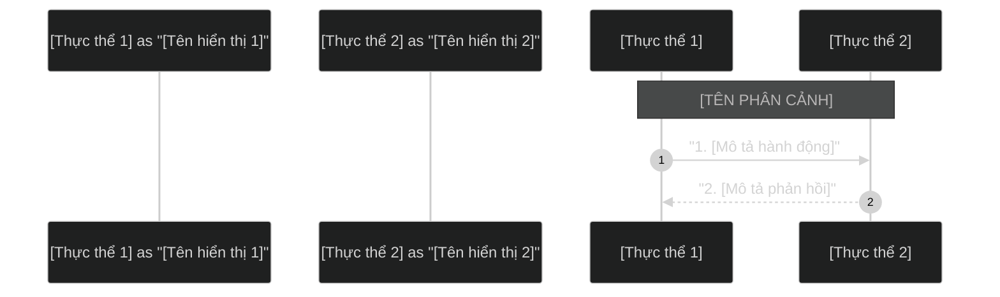

# Skill Vẽ Sơ Đồ Hệ Thống & Trực Quan Hóa (Diagram Drawer)

Skill này hướng dẫn chi tiết cách thiết kế sơ đồ dạng Mermaid (đặc biệt là Sequence Diagram) theo chuẩn giao diện nền tối (Dark Theme), xuất ra ảnh PNG/SVG chất lượng cao và trình bày tài liệu theo đúng cấu trúc template chuẩn của dự án.

---

## 1. Nguyên Tắc Thiết Kế Sơ Đồ Mermaid

Khi viết code Mermaid cho Sequence Diagram, luôn tuân thủ các quy tắc sau để đảm bảo sơ đồ trực quan và không bị lỗi biên dịch:

### A. Cấu Hình Theme Tối (Dark Theme)
Luôn đặt chỉ thị cấu hình theme tối ở ngay dòng đầu tiên của khối code Mermaid:
```mermaid
%%{init: { 'theme': 'dark' } }%%
```

### B. Khai Báo Participant Thay Vì Actor
Để các hộp thực thể hiển thị dạng chữ nhật bo góc đồng bộ (giống mẫu EcoGreen), hãy khai báo tất cả các bên tham gia là `participant` thay vì `actor` (hình người):
```mermaid
participant Customer as "Khách hàng"
participant Portal as "CMS Portal"
```

### C. Dấu Cách Trong Phân Cảnh (Note over)
Cú pháp `Note over` để vẽ các dải phân cảnh nằm ngang kéo dài bắt buộc phải có **dấu cách (space) sau dấu phẩy** ngăn cách giữa 2 thực thể:
- **ĐÚNG:** `Note over Admin, Customer: TIÊU ĐỀ PHÂN CẢNH`
- **SAI:** `Note over Admin,Customer: TIÊU ĐỀ PHÂN CẢNH` (Không có dấu cách sẽ gây lỗi biên dịch *Unknown diagram error*).

### D. Sử Dụng Dấu Ngoặc Kép Cho Nội Dung Tin Nhắn
Để tránh lỗi phân tích cú pháp khi nội dung tin nhắn chứa ký tự đặc biệt hoặc tiếng Việt, hãy luôn bọc các mô tả tin nhắn trong dấu ngoặc kép `""`:
```mermaid
Admin->>Portal: "1. Tạo/Sửa bài viết (Gán tag: 'camera')"
```

---

## 2. Template Cấu Trúc File Trình Bày Sơ Đồ

Mỗi sơ đồ khi tạo ra sẽ chỉ bao gồm **2 file duy nhất** nằm trong thư mục `diagrams/`:
1.  **File tài liệu Markdown (`[tên-sơ-đồ].md`):** File trình bày, chứa cả mã nguồn Mermaid (trong khối code block) và hình ảnh hiển thị kèm mô tả nghiệp vụ chi tiết.
2.  **File ảnh PNG (`[tên-sơ-đồ].png`):** File ảnh được biên dịch ra từ khối code Mermaid nằm trong file Markdown để nhúng hiển thị trực tiếp.

Tuyệt đối **KHÔNG** tạo thêm các file nguồn riêng lẻ `.mermaid`, file vector `.svg` hoặc script `.ps1` riêng cho từng sơ đồ để tránh làm rác thư mục.

### Template File `.md` chuẩn (`diagrams/[tên-sơ-đồ].md`)
```markdown
# Sơ đồ Sequence Diagram: [TÊN SƠ ĐỒ]

Dưới đây là sơ đồ trực quan luồng [MÔ TẢ NGẮN GỌN LUỒNG HOẠT ĐỘNG].


## Mã nguồn Mermaid (Dùng để render ảnh)


## Giải thích luồng nghiệp vụ chi tiết

### 1. [Phân đoạn nghiệp vụ 1]
*   **Bước 1 - N:** [Giải thích chi tiết hoạt động của các bước]

### 2. [Phân đoạn nghiệp vụ 2]
*   **Bước N+1 - M:** [Giải thích chi tiết hoạt động của các bước]
```

---

## 3. Quy Trình Tự Động Biên Dịch Mermaid sang PNG từ file MD

Để tạo ra file ảnh PNG có nền tối solid màu `#121212` trực tiếp từ khối code Mermaid trong file Markdown, sử dụng lệnh PowerShell sau:

### Lệnh PowerShell biên dịch nhanh:
```powershell
$name = "[tên-sơ-đồ]"; $md = Get-Content -Path "diagrams/$name.md" -Raw -Encoding UTF8; if ($md -match '(?s)```mermaid\s*\r?\n(.*?)\r?\n```') { $code = $Matches[1].Trim(); $bytes = [System.Text.Encoding]::UTF8.GetBytes($code); $b64 = [Convert]::ToBase64String($bytes).Replace('+', '-').Replace('/', '_').Replace('=', ''); Invoke-WebRequest -Uri "https://mermaid.ink/img/${b64}?bgColor=121212&type=png" -OutFile "diagrams/$name.png" -UserAgent "Mozilla/5.0" }
```

Hoặc bạn có thể chạy file script PowerShell dùng chung [generate_images.ps1](file:///c:/Users/Admin/OneDrive/Desktop/FPT/diagrams/generate_images.ps1) (nếu có) bằng cách truyền tên sơ đồ làm tham số.

---

## 4. Thư Mục Templates

Skill này đi kèm một thư mục `templates/` chứa các file mẫu sẵn sàng để sử dụng ngay:

| File | Mô tả |
|------|--------|
| `templates/sequence-template.md` | Mẫu file tài liệu Markdown kèm khối code Mermaid và chỗ nhúng ảnh PNG. |
| `templates/example-related-articles.md` | Ví dụ thực tế hoàn chỉnh (Sơ đồ "Thông tin hay theo Tag sản phẩm") để tham khảo. |

### Quy Trình Tạo Sơ Đồ Mới (Dùng Template):
1. Copy file `templates/sequence-template.md` → `diagrams/[tên-mới].md` và điền nội dung sơ đồ vào khối code block ````mermaid```` cùng phần mô tả.
2. Chạy lệnh PowerShell biên dịch nhanh ở trên (thay thế `$name = "[tên-mới]"`) để sinh ra file ảnh `diagrams/[tên-mới].png`.
3. Kiểm tra hiển thị trong file Markdown mới tạo.

