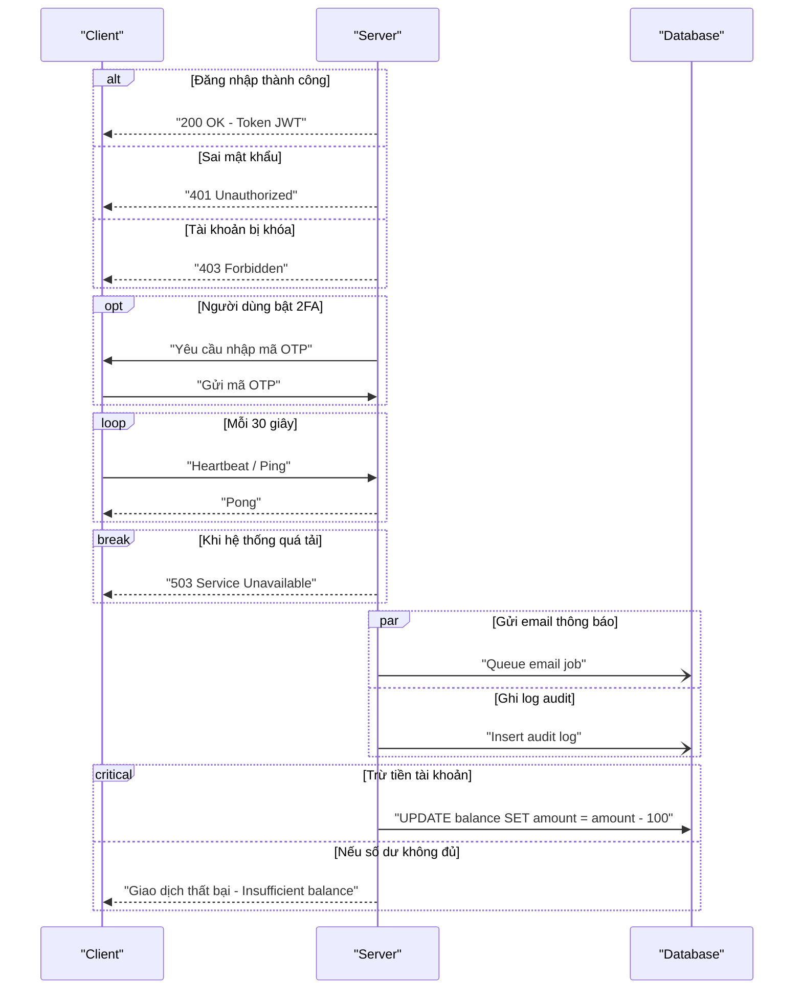
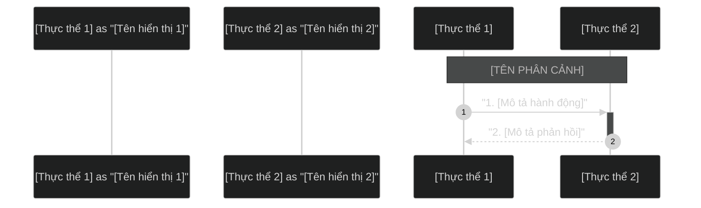

# Skill Vẽ Sơ Đồ Hệ Thống & Trực Quan Hóa (Diagram Drawer)

Skill này hướng dẫn chi tiết cách thiết kế sơ đồ dạng Mermaid (đặc biệt là Sequence Diagram) theo chuẩn giao diện nền tối (Dark Theme), xuất ra ảnh PNG/SVG chất lượng cao và trình bày tài liệu theo đúng cấu trúc template chuẩn của dự án.

---

## 1. Bộ Quy Tắc Ký Hiệu UML Sequence Diagram (Chuẩn draw.io / UML 2.5)

Dưới đây là **bảng tổng hợp đầy đủ** tất cả ký hiệu (notation) trong Sequence Diagram theo chuẩn UML 2.5 (giống draw.io), kèm theo cú pháp tương ứng trong Mermaid.

### A. Thành Phần Cốt Lõi (Core Elements)

| # | Ký hiệu UML | Hình dạng (Draw.io) | Ý nghĩa | Cú pháp Mermaid |
|---|-------------|---------------------|---------|-----------------|
| 1 | **Actor** | 🧍 Hình người que (stick figure) | Thực thể bên ngoài tương tác với hệ thống (người dùng, hệ thống ngoài) | `actor User as "Người dùng"` |
| 2 | **Participant (Object)** | 📦 Hộp chữ nhật bo góc | Đối tượng/thành phần tham gia luồng tương tác (class, service, module) | `participant System as "Hệ thống"` |
| 3 | **Lifeline** | ┆ Đường đứt nét dọc kéo xuống từ participant | Biểu thị sự tồn tại của đối tượng theo trục thời gian (đọc từ trên xuống) | Tự động sinh khi khai báo participant/actor |
| 4 | **Activation Box (Execution Specification)** | ▮ Hộp chữ nhật mỏng trên lifeline | Khoảng thời gian đối tượng đang **xử lý tích cực** (đang thực thi operation) | `activate A` / `deactivate A` hoặc ký hiệu `+`/`-` trên mũi tên |

#### Quy tắc chọn Actor vs Participant:
- **Dùng `actor`** khi thực thể là **con người hoặc hệ thống bên ngoài** (End-user, Admin, 3rd-party API)
- **Dùng `participant`** khi thực thể là **thành phần nội bộ hệ thống** (Service, Database, Module, Component)
- **Quy ước dự án**: Ưu tiên dùng `participant` cho tất cả để đảm bảo hiển thị đồng bộ hộp chữ nhật. Chỉ dùng `actor` khi muốn nhấn mạnh vai trò con người.

---

### B. Các Loại Tin Nhắn / Mũi Tên (Message Types)

Đây là phần **quan trọng nhất**, tương ứng với các mũi tên trong bảng ký hiệu draw.io:

| # | Loại Message | Ký hiệu Mũi tên | Mô tả | Cú pháp Mermaid |
|---|-------------|-----------------|-------|-----------------|
| 1 | **Synchronous (Đồng bộ)** | ──────▶ (Nét liền, đầu mũi tên **đặc/lấp đầy**) | Bên gửi **chờ** phản hồi trước khi tiếp tục. Ví dụ: gọi hàm, HTTP request chờ response | `A->>B: "Gọi API đồng bộ"` |
| 2 | **Asynchronous (Bất đồng bộ)** | ──────▷ (Nét liền, đầu mũi tên **mở/rỗng**) | Bên gửi **không chờ** phản hồi, tiếp tục xử lý ngay. Ví dụ: gửi event, push notification | `A-)B: "Gửi event bất đồng bộ"` |
| 3 | **Return (Phản hồi)** | ╌╌╌╌╌╌▷ (Nét **đứt**, đầu mũi tên mở) | Trả về kết quả/giá trị cho lời gọi trước đó | `B-->>A: "Trả về kết quả"` |
| 4 | **Self-Message (Tự gọi)** | ↻ Mũi tên vòng ngược lại chính mình | Đối tượng gọi method/xử lý nội bộ của chính nó | `A->>A: "Xử lý logic nội bộ"` |
| 5 | **Solid Line (Nét liền, không mũi tên)** | ────── (Nét liền, không có đầu) | Liên kết đơn giản, ít dùng trong sequence | `A->B: "Tin nhắn"` |
| 6 | **Dotted Line (Nét đứt, không mũi tên)** | ╌╌╌╌╌╌ (Nét đứt, không có đầu) | Liên kết phản hồi đơn giản | `A-->B: "Phản hồi"` |

#### Bảng Tra Cứu Nhanh Mũi Tên Mermaid:
```
Cú pháp Mermaid    │ Kiểu đường │ Kiểu đầu mũi tên    │ Dùng khi
───────────────────┼────────────┼──────────────────────┼─────────────────
  A->B             │ Nét liền   │ Không có đầu         │ Ít dùng
  A-->B            │ Nét đứt    │ Không có đầu         │ Ít dùng
  A->>B            │ Nét liền   │ Mũi tên đặc (▶)     │ ★ Gọi đồng bộ (sync call)
  A-->>B           │ Nét đứt    │ Mũi tên đặc (▶)     │ ★ Phản hồi (return)
  A-)B             │ Nét liền   │ Mũi tên mở (▷)      │ ★ Gọi bất đồng bộ (async)
  A--)B            │ Nét đứt    │ Mũi tên mở (▷)      │ Phản hồi bất đồng bộ
  A->>+B           │ Nét liền   │ Mũi tên đặc + Kích  │ ★ Gọi & kích hoạt (activate)
  B-->>-A          │ Nét đứt    │ Mũi tên đặc + Hủy   │ ★ Trả về & hủy kích hoạt
```

---

### C. Activation (Hộp Kích Hoạt / Execution Specification)

Activation Box biểu thị khoảng thời gian một đối tượng đang tích cực xử lý. Trong draw.io hiển thị là hộp chữ nhật mỏng nằm trên lifeline.

#### Cách 1: Ký hiệu viết tắt trên mũi tên (Khuyến nghị)
```mermaid
A->>+B: "Gọi API"        %% Mũi tên + dấu "+" → kích hoạt B
B-->>-A: "Trả kết quả"   %% Mũi tên + dấu "-" → hủy kích hoạt B
```

#### Cách 2: Khai báo tường minh
```mermaid
A->>B: "Gọi API"
activate B                 %% Bắt đầu hộp activation trên lifeline B
B->>B: "Xử lý nội bộ"
B-->>A: "Trả kết quả"
deactivate B               %% Kết thúc hộp activation
```

#### Activation lồng nhau (Nested Activation):
```mermaid
A->>+B: "Gọi B"
B->>+C: "B gọi tiếp C"    %% C được activate trong khi B vẫn active
C-->>-B: "C trả về"       %% Deactivate C
B-->>-A: "B trả về"       %% Deactivate B
```

---

### D. Tạo & Hủy Đối Tượng (Create & Destroy)

Trong draw.io: **Create** = mũi tên đứt nét chỉ tới hộp participant mới xuất hiện; **Destroy** = dấu ✕ (chữ X lớn) đặt ở cuối lifeline.

```mermaid
%% Tạo đối tượng mới giữa chừng
create participant Session as "Session"
A->>Session: "Khởi tạo session mới"

%% Hủy đối tượng
destroy Session
A-xSession: "Đóng và hủy session"
```

> **Lưu ý:** `create` và `destroy` là từ khóa Mermaid v10.9+. Kiểm tra phiên bản Mermaid khi sử dụng.

---

### E. Combined Fragments (Khung Logic Phức Hợp)

Combined Fragments trong draw.io là **khung hình chữ nhật lớn** bao quanh một nhóm tin nhắn, có nhãn loại ở góc trên-trái. Đây là công cụ mạnh nhất để biểu diễn logic điều kiện, lặp, song song.

| # | Fragment | Ký hiệu Draw.io | Ý nghĩa | Cú pháp Mermaid |
|---|----------|-----------------|---------|-----------------|
| 1 | **alt** | Khung chia đôi bằng nét đứt ngang, nhãn `alt` | Rẽ nhánh if-else: chỉ **1 nhánh** được thực thi | `alt ... else ... end` |
| 2 | **opt** | Khung đơn, nhãn `opt` | Tùy chọn (chỉ if, không else): thực thi nếu điều kiện đúng | `opt ... end` |
| 3 | **loop** | Khung đơn, nhãn `loop` | Lặp lại: thực thi nhiều lần theo điều kiện | `loop ... end` |
| 4 | **break** | Khung đơn, nhãn `break` | Ngoại lệ/thoát: nếu điều kiện đúng, thoát khỏi luồng bao ngoài | `break ... end` |
| 5 | **par** | Khung chia bằng nét đứt, nhãn `par` | Song song: các phân đoạn chạy **đồng thời** | `par ... and ... end` |
| 6 | **critical** | Khung đơn, nhãn `critical` | Vùng tới hạn: chỉ 1 thread được truy cập tại 1 thời điểm | `critical ... option ... end` |

#### Ví dụ đầy đủ các loại Fragment:



---

### F. Ghi Chú (Notes)

Ghi chú trong draw.io là hộp chữ nhật có góc gấp, nối tới lifeline bằng nét đứt.

```mermaid
%% Ghi chú bên trái participant
Note left of A: Ghi chú bên trái

%% Ghi chú bên phải participant
Note right of B: Ghi chú bên phải

%% Ghi chú trải ngang qua nhiều participant (dải phân cảnh)
Note over A, B: TIÊU ĐỀ PHÂN CẢNH
```

> **⚠️ BẮT BUỘC:** Luôn có **dấu cách sau dấu phẩy** trong `Note over A, B` (ĐÚNG) thay vì `Note over A,B` (SAI - gây lỗi biên dịch).

---

### G. Vùng Đánh Dấu / Highlight (rect)

Dùng `rect` để tô nền nhóm tin nhắn, giúp nhấn mạnh một phần trong sơ đồ.

```mermaid
rect rgb(40, 40, 80)
    A->>B: "Bước quan trọng được highlight"
    B-->>A: "Phản hồi"
end

rect rgba(255, 165, 0, 0.15)
    Note over A, B: Khu vực cảnh báo
    A->>B: "Hành động cần chú ý"
end
```

---

### H. Bảng Tổng Hợp Mapping: Ký Hiệu Draw.io → Mermaid Syntax

Bảng tham chiếu nhanh cho toàn bộ ký hiệu:

| Ký hiệu Draw.io | Hình | Mermaid Syntax | Ghi chú |
|:---|:---:|:---|:---|
| Actor | 🧍 | `actor X as "Tên"` | Hình người que |
| Object / Participant | 📦 | `participant X as "Tên"` | Hộp chữ nhật |
| Lifeline | ┆ | *(tự động)* | Đường đứt dọc |
| Activation Box | ▮ | `activate X` / `deactivate X` hoặc `+`/`-` | Hộp mỏng trên lifeline |
| Synchronous Message | ──▶ | `A->>B: "msg"` | Nét liền, đầu đặc |
| Asynchronous Message | ──▷ | `A-)B: "msg"` | Nét liền, đầu mở |
| Return Message | ╌╌▷ | `A-->>B: "msg"` | Nét đứt, phản hồi |
| Self-Message | ↻ | `A->>A: "msg"` | Tự gọi chính mình |
| Create | ╌╌▷📦 | `create participant X` | Tạo đối tượng mới |
| Destroy | ✕ | `destroy X` | Hủy đối tượng |
| Cross Message | ──✕ | `A-xB: "msg"` | Mũi tên có X ở đầu |
| Note | 📝 | `Note left/right/over ...` | Hộp ghi chú |
| alt Fragment | [alt] | `alt ... else ... end` | Rẽ nhánh điều kiện |
| opt Fragment | [opt] | `opt ... end` | Tùy chọn |
| loop Fragment | [loop] | `loop ... end` | Vòng lặp |
| break Fragment | [break] | `break ... end` | Ngoại lệ/thoát |
| par Fragment | [par] | `par ... and ... end` | Song song |
| critical Fragment | [critical] | `critical ... option ... end` | Vùng tới hạn |
| Highlight Area | 🟦 | `rect rgb(...) ... end` | Tô nền highlight |

---

## 2. Nguyên Tắc Thiết Kế Sơ Đồ Mermaid

Khi viết code Mermaid cho Sequence Diagram, luôn tuân thủ các quy tắc sau để đảm bảo sơ đồ trực quan và không bị lỗi biên dịch:

### A. Cấu Hình Theme Tối (Dark Theme)
Luôn đặt chỉ thị cấu hình theme tối ở ngay dòng đầu tiên của khối code Mermaid:
```mermaid
%%{init: { 'theme': 'dark' } }%%
```

### B. Khai Báo Participant / Actor
- **`participant`**: Hiển thị dạng hộp chữ nhật bo góc — dùng cho thành phần nội bộ hệ thống
- **`actor`**: Hiển thị dạng hình người que — dùng cho người dùng hoặc hệ thống bên ngoài
- **Quy ước dự án**: Mặc định dùng `participant` cho tất cả. Chỉ dùng `actor` khi cần nhấn mạnh rõ ràng đây là con người.

```mermaid
participant Customer as "Khách hàng"
participant Portal as "CMS Portal"
```

### C. Dấu Cách Trong Phân Cảnh (Note over)
Cú pháp `Note over` để vẽ các dải phân cảnh nằm ngang kéo dài bắt buộc phải có **dấu cách (space) sau dấu phẩy** ngăn cách giữa 2 thực thể:
- **ĐÚNG:** `Note over Admin, Customer: TIÊU ĐỀ PHÂN CẢNH`
- **SAI:** `Note over Admin,Customer: TIÊU ĐỀ PHÂN CẢNH` (Không có dấu cách sẽ gây lỗi biên dịch *Unknown diagram error*).

### D. Sử Dụng Dấu Ngoặc Kép Cho Nội Dung Tin Nhắn
Để tránh lỗi phân tích cú pháp khi nội dung tin nhắn chứa ký tự đặc biệt hoặc tiếng Việt, hãy luôn bọc các mô tả tin nhắn trong dấu ngoặc kép `""`:
```mermaid
Admin->>Portal: "1. Tạo/Sửa bài viết (Gán tag: 'camera')"
```

### E. Sử Dụng `autonumber` Cho Đánh Số Tự Động
Luôn thêm `autonumber` ngay sau `sequenceDiagram` để Mermaid tự đánh số thứ tự tin nhắn:
```mermaid
sequenceDiagram
    autonumber
```

---

## 3. Template Cấu Trúc File Trình Bày Sơ Đồ

Mỗi sơ đồ khi tạo ra sẽ chỉ bao gồm **2 file duy nhất** nằm trong thư mục `diagrams/`:
1.  **File tài liệu Markdown (`[tên-sơ-đồ].md`):** File trình bày, chứa cả mã nguồn Mermaid (trong khối code block) và hình ảnh hiển thị kèm mô tả nghiệp vụ chi tiết.
2.  **File ảnh PNG (`[tên-sơ-đồ].png`):** File ảnh được biên dịch ra từ khối code Mermaid nằm trong file Markdown để nhúng hiển thị trực tiếp.

Tuyệt đối **KHÔNG** tạo thêm các file nguồn riêng lẻ `.mermaid`, file vector `.svg` hoặc script `.ps1` riêng cho từng sơ đồ để tránh làm rác thư mục.

### Template File `.md` chuẩn (`diagrams/[tên-sơ-đồ].md`)
```markdown
# Sơ đồ Sequence Diagram: [TÊN SƠ ĐỒ]

Dưới đây là sơ đồ trực quan luồng [MÔ TẢ NGẮN GỌN LUỒNG HOẠT ĐỘNG].


## Mã nguồn Mermaid (Dùng để render ảnh)


## Bảng ký hiệu sử dụng trong sơ đồ

| Ký hiệu | Ý nghĩa |
|----------|---------|
| `participant` | Thành phần hệ thống (hộp chữ nhật) |
| `actor` | Người dùng bên ngoài (hình người) |
| `──▶` (`->>`) | Gọi đồng bộ (chờ phản hồi) |
| `╌╌▶` (`-->>`) | Phản hồi / Return |
| `──▷` (`-)`) | Gọi bất đồng bộ |
| `↻` (`A->>A`) | Tự gọi nội bộ |
| `▮ activate/deactivate` | Hộp kích hoạt (đang xử lý) |
| `alt/else/end` | Rẽ nhánh điều kiện |
| `opt/end` | Xử lý tùy chọn |
| `loop/end` | Vòng lặp |
| `par/and/end` | Xử lý song song |
| `Note over` | Dải phân cảnh / Ghi chú |
| `rect` | Highlight vùng quan trọng |

## Giải thích luồng nghiệp vụ chi tiết

### 1. [Phân đoạn nghiệp vụ 1]
*   **Bước 1 - N:** [Giải thích chi tiết hoạt động của các bước]

### 2. [Phân đoạn nghiệp vụ 2]
*   **Bước N+1 - M:** [Giải thích chi tiết hoạt động của các bước]
```

---

## 4. Quy Trình Tự Động Biên Dịch Mermaid sang PNG từ file MD

Để tạo ra file ảnh PNG có nền tối solid màu `#121212` trực tiếp từ khối code Mermaid trong file Markdown, sử dụng lệnh PowerShell sau:

### Lệnh PowerShell biên dịch nhanh:
```powershell
$name = "[tên-sơ-đồ]"; $md = Get-Content -Path "diagrams/$name.md" -Raw -Encoding UTF8; if ($md -match '(?s)```mermaid\s*\r?\n(.*?)\r?\n```') { $code = $Matches[1].Trim(); $bytes = [System.Text.Encoding]::UTF8.GetBytes($code); $b64 = [Convert]::ToBase64String($bytes).Replace('+', '-').Replace('/', '_').Replace('=', ''); Invoke-WebRequest -Uri "https://mermaid.ink/img/${b64}?bgColor=121212&type=png" -OutFile "diagrams/$name.png" -UserAgent "Mozilla/5.0" }
```

Hoặc bạn có thể chạy file script PowerShell dùng chung [generate_images.ps1](file:///c:/Users/Admin/OneDrive/Desktop/FPT/diagrams/generate_images.ps1) (nếu có) bằng cách truyền tên sơ đồ làm tham số.

---

## 5. Thư Mục Templates

Skill này đi kèm một thư mục `templates/` chứa các file mẫu sẵn sàng để sử dụng ngay:

| File | Mô tả |
|------|--------|
| `templates/sequence-template.md` | Mẫu file tài liệu Markdown kèm khối code Mermaid và chỗ nhúng ảnh PNG. |
| `templates/example-related-articles.md` | Ví dụ thực tế hoàn chỉnh (Sơ đồ "Thông tin hay theo Tag sản phẩm") để tham khảo. |

### Quy Trình Tạo Sơ Đồ Mới (Dùng Template):
1. Copy file `templates/sequence-template.md` → `diagrams/[tên-mới].md` và điền nội dung sơ đồ vào khối code block ````mermaid```` cùng phần mô tả.
2. Chạy lệnh PowerShell biên dịch nhanh ở trên (thay thế `$name = "[tên-mới]"`) để sinh ra file ảnh `diagrams/[tên-mới].png`.
3. Kiểm tra hiển thị trong file Markdown mới tạo.
