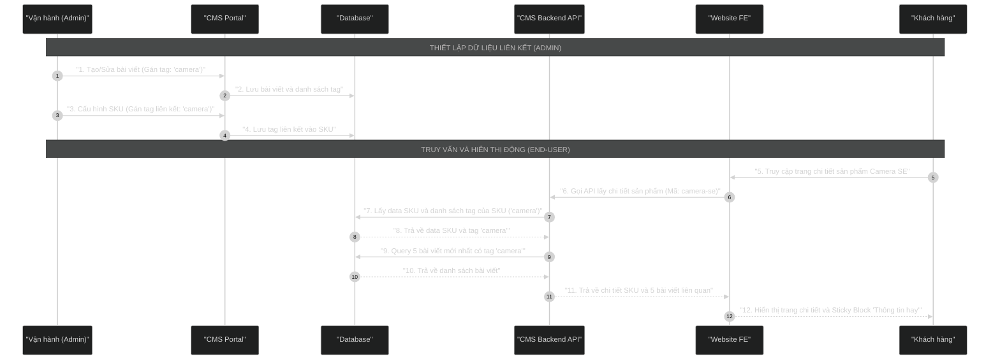

# Ví Dụ Thực Tế: Sơ Đồ "Hiển thị Block Thông tin hay theo Tag sản phẩm"

Đây là ví dụ mẫu hoàn chỉnh cho một sơ đồ Sequence Diagram được tạo bằng skill `diagram-drawer`.

---

## 1. File nguồn Mermaid (`related-articles-by-tag-sequence.mermaid`)



---

## 2. File tài liệu Markdown (`related-articles-by-tag-sequence.md`)

```markdown
# Sơ đồ Sequence Diagram: Hiển thị Block "Thông tin hay" theo Tag sản phẩm

Dưới đây là sơ đồ trực quan luồng tự động hiển thị bài viết liên quan (Thông tin hay) dựa trên Tag sản phẩm.


## Giải thích luồng nghiệp vụ chi tiết

### 1. Phân hệ thiết lập (Vận hành Admin)
*   **Bước 1 - 2:** Khi Vận hành đăng tải hoặc chỉnh sửa bài viết trong module Quản lý Bài viết & FAQ,
    họ sẽ gán các tag có liên quan. Ví dụ: một bài viết về đánh giá camera sẽ được đánh tag "camera".
    Hệ thống lưu thông tin bài viết kèm tag vào DB.
*   **Bước 3 - 4:** Trong tab Quản lý Content của màn hình chi tiết SKU/Sản phẩm, Vận hành gán tag
    "camera" cho dòng sản phẩm tương ứng. Hệ thống ghi nhận tag này vào cơ sở dữ liệu SKU.

### 2. Phân hệ hiển thị (End-User)
*   **Bước 5 - 6:** Khách hàng truy cập trang chi tiết sản phẩm Camera SE.
    Trình duyệt gửi yêu cầu lấy dữ liệu chi tiết sản phẩm tới CMS API.
*   **Bước 7 - 8:** API truy xuất thông tin SKU từ DB, lấy ra được tag liên kết là "camera".
*   **Bước 9 - 10:** CMS API thực hiện truy vấn thứ hai tới DB để tìm kiếm các bài viết được đánh tag
    "camera", sắp xếp theo thời gian mới nhất và giới hạn tối đa 5 bài viết.
*   **Bước 11 - 12:** API tổng hợp thông tin SKU và danh sách bài viết trùng tag trả về cho Website FE.
    Giao diện dựng hoàn chỉnh thông số sản phẩm và khối Sticky "Thông tin hay" hiển thị dọc trang.
```

---

## 3. File Script biên dịch (`generate_images.ps1`)

```powershell
$diagramName = "related-articles-by-tag-sequence"

$content = Get-Content -Path "diagrams/$diagramName.mermaid" -Encoding UTF8
$pureCodeLines = @()
foreach ($line in $content) {
    if ($line -notmatch '```') {
        $pureCodeLines += $line
    }
}
$pureCode = $pureCodeLines -join "`n"
$pureCode = $pureCode.Trim()

$bytes = [System.Text.Encoding]::UTF8.GetBytes($pureCode)
$base64 = [Convert]::ToBase64String($bytes)
$base64Safe = $base64.Replace('+', '-').Replace('/', '_').Replace('=', '')

$svgUrl = "https://mermaid.ink/svg/${base64Safe}?bgColor=121212"
$pngUrl = "https://mermaid.ink/img/${base64Safe}?bgColor=121212"

Invoke-WebRequest -Uri $svgUrl -OutFile "diagrams/$diagramName.svg" -UserAgent "Mozilla/5.0"
Invoke-WebRequest -Uri $pngUrl -OutFile "diagrams/$diagramName.png" -UserAgent "Mozilla/5.0"
```

---

## 4. Kết quả xuất ra

Sau khi chạy script, thư mục `diagrams/` sẽ có các file sau:
- `related-articles-by-tag-sequence.mermaid` — File nguồn code Mermaid
- `related-articles-by-tag-sequence.md` — Tài liệu trình bày tích hợp ảnh
- `related-articles-by-tag-sequence.png` — Ảnh sơ đồ nền tối (Dùng để xem/chia sẻ)
- `related-articles-by-tag-sequence.svg` — Ảnh vector (Dùng khi cần phóng to/thu nhỏ không vỡ)
