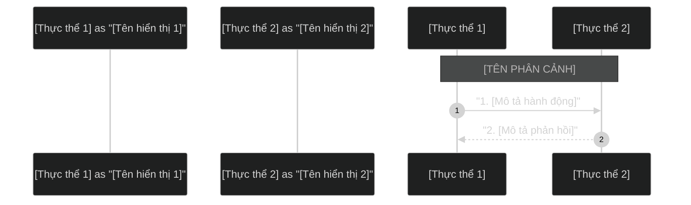

# Sơ đồ Sequence Diagram: {{TÊN_SƠ_ĐỒ}}

{{MÔ_TẢ_NGẮN_GỌN_LUỒNG_HOẠT_ĐỘNG}}

## Mã nguồn Mermaid (Dùng để render ảnh)

## Giải thích luồng nghiệp vụ chi tiết

### 1. {{Phân đoạn nghiệp vụ 1}}
*   **Bước 1 - 2:** {{Giải thích chi tiết hoạt động của các bước trong phân đoạn 1}}
*   **Bước 3 - 4:** {{Giải thích chi tiết hoạt động tiếp theo}}

### 2. {{Phân đoạn nghiệp vụ 2}}
*   **Bước 5 - 6:** {{Giải thích chi tiết hoạt động của các bước trong phân đoạn 2}}
*   **Bước 7 - 8:** {{Giải thích chi tiết hoạt động tiếp theo}}
