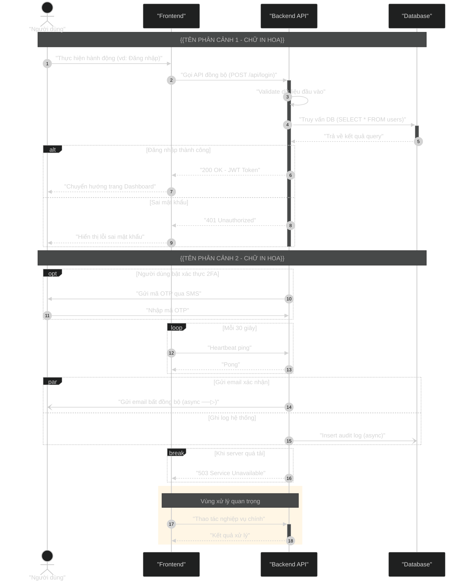

# Sơ đồ Sequence Diagram: {{TÊN_SƠ_ĐỒ}}

{{MÔ_TẢ_NGẮN_GỌN_LUỒNG_HOẠT_ĐỘNG}}

## Mã nguồn Mermaid (Dùng để render ảnh)

## Bảng ký hiệu sử dụng trong sơ đồ

| Ký hiệu | Cú pháp Mermaid | Ý nghĩa |
|:--------:|:----------------|:---------|
| 🧍 Actor | `actor X as "Tên"` | Người dùng / Hệ thống bên ngoài |
| 📦 Participant | `participant X as "Tên"` | Thành phần nội bộ hệ thống |
| ──▶ Sync | `A->>B: "msg"` | Gọi đồng bộ (chờ phản hồi) |
| ╌╌▶ Return | `A-->>B: "msg"` | Phản hồi / Trả về kết quả |
| ──▷ Async | `A-)B: "msg"` | Gọi bất đồng bộ (không chờ) |
| ↻ Self | `A->>A: "msg"` | Tự gọi nội bộ |
| ▮ Activate | `activate X` / `+` `-` | Hộp kích hoạt (đang xử lý) |
| [alt] | `alt ... else ... end` | Rẽ nhánh if-else |
| [opt] | `opt ... end` | Xử lý tùy chọn (chỉ if) |
| [loop] | `loop ... end` | Vòng lặp |
| [par] | `par ... and ... end` | Xử lý song song |
| [break] | `break ... end` | Ngoại lệ / Thoát |
| [critical] | `critical ... option ... end` | Vùng tới hạn |
| 📝 Note | `Note over/left/right` | Ghi chú / Dải phân cảnh |
| 🟦 Rect | `rect rgb(...) ... end` | Highlight vùng quan trọng |

## Giải thích luồng nghiệp vụ chi tiết

### 1. {{Phân đoạn nghiệp vụ 1}}
*   **Bước 1 - N:** {{Giải thích chi tiết hoạt động của các bước trong phân đoạn 1}}
*   **Bước N+1 - M:** {{Giải thích chi tiết hoạt động tiếp theo}}

### 2. {{Phân đoạn nghiệp vụ 2}}
*   **Bước M+1 - P:** {{Giải thích chi tiết hoạt động của các bước trong phân đoạn 2}}
*   **Bước P+1 - Q:** {{Giải thích chi tiết hoạt động tiếp theo}}
