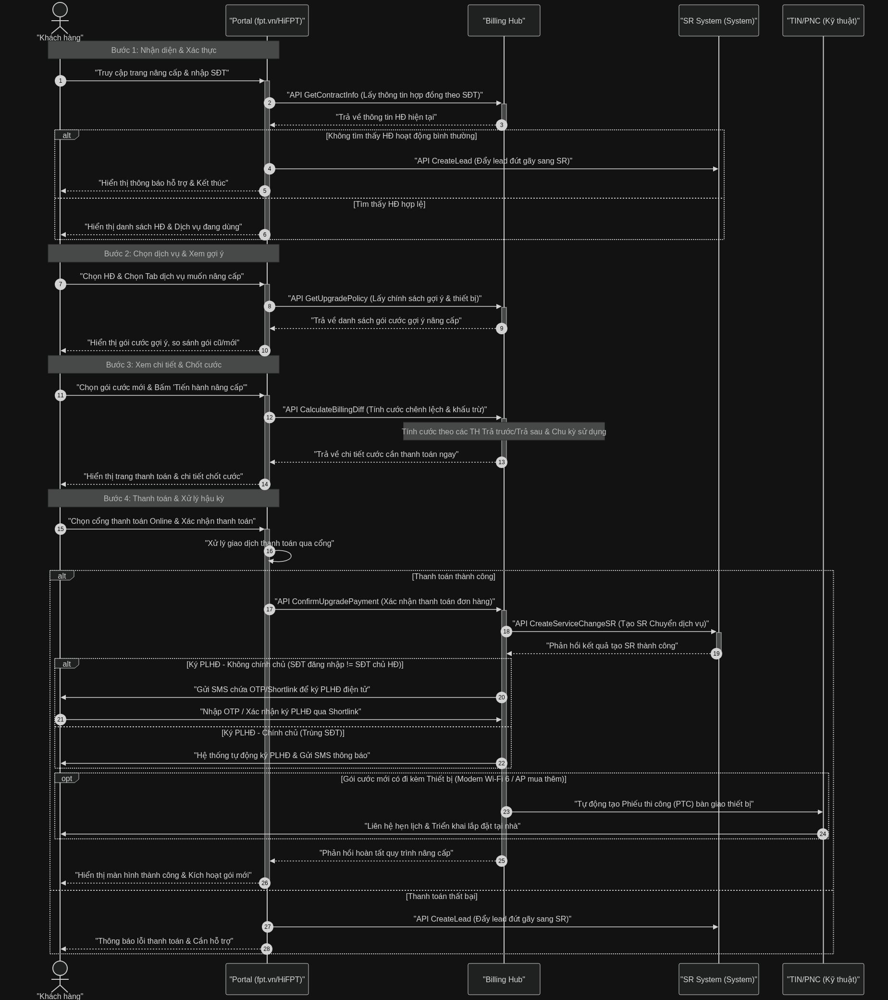

# TÀI LIỆU PHÂN TÍCH UI/UX & LUỒNG TƯƠNG TÁC
## NÂNG CẤP 5 DỊCH VỤ SELF-SERVICE (ISC - PHASE 1)

---

## 1. TỔNG QUAN DỰ ÁN

*   **Mục tiêu**: Tối ưu hóa tỷ lệ khách hàng tự phục vụ (Self-service), thúc đẩy chuyển đổi nâng cấp gói dịch vụ và mua thêm thiết bị trực tuyến trên các kênh số (Website `FPT.vn` và Ứng dụng `HiFPT`).
*   **Mục tiêu UI/UX**: Xây dựng trải nghiệm nhất quán, trực quan, giảm thiểu ma sát đầu vào, minh bạch hóa cách tính cước chênh lệch và hỗ trợ phục hồi các giao dịch đứt gãy nhằm tối ưu hóa tỷ lệ chuyển đổi (Conversion Rate).
*   **Đối tượng áp dụng**: Khách hàng cá nhân đang sở hữu Hợp đồng (HĐ) Internet/Combo hoạt động bình thường, không nợ cước và không có hóa đơn trả trước chờ xử lý.

---

## 2. SƠ ĐỒ TRÌNH TỰ TỔNG QUÁT (SEQUENCE DIAGRAM)

Dưới đây là sơ đồ trình tự tương tác giữa Khách hàng, Portal (Kênh bán), Billing Hub và hệ thống SR (Sale Referral) trong quy trình nâng cấp dịch vụ tự phục vụ:



*Chi tiết mã nguồn sơ đồ được lưu tại [upgrade_services_selfservice_flow.md](file:///c:/Users/hoang/OneDrive/Desktop/FPT/diagrams/upgrade_services_selfservice_flow.md).*

---

## 3. PHÂN TÍCH UI/UX CHI TIẾT CHO 5 LUỒNG DỊCH VỤ

### 3.1. Luồng 1: Nâng cấp Băng thông (Internet Only hoặc Combo)
*   **Bối cảnh nghiệp vụ**: Khách hàng nâng cấp từ gói băng thông thấp lên gói băng thông cao hơn (ví dụ: `Giga (150 Mbps) -> Sky (1 Gbps)` hoặc `Sky -> Meta`). Không hỗ trợ đổi thiết bị modem riêng lẻ ở Phase 1 (trừ khi gói mới mặc định đi kèm thiết bị mới theo chính sách Billing Hub).
*   **Đề xuất thiết kế UI/UX**:
    *   **Thẻ So sánh gói (Visual Comparison Cards)**: 
        *   Tránh hiển thị dạng bảng thông số kỹ thuật khô khan. Hãy thiết kế thanh đo tốc độ đồ họa (Speedometer) trực quan thể hiện tốc độ gói cũ và gói mới.
        *   Sử dụng màu cam FPT (`var(--brand-600)`) để làm nổi bật tốc độ vượt trội của gói mới.
    *   **Tối ưu tâm lý chi phí (Micro-pricing)**:
        *   Thay vì chỉ hiển thị tổng giá tiền của gói mới (ví dụ: `280.000 đ/tháng`), hãy hiển thị thêm phần cước chênh lệch hàng tháng với kích thước chữ nổi bật: **"Chỉ thêm +50.000 đ/tháng"**. Cách tiếp cận này giúp giảm rào cản tài chính trong tâm lý khách hàng.
    *   **Giao diện Tóm tắt cước tạm tính**:
        *   Khi khách hàng bấm nâng cấp, hiển thị bảng kê chi tiết cước tạm tính (From-date gói mới bắt đầu từ thời điểm đăng ký thành công).

```
┌────────────────────────────────────────────────────────┐
│ SO SÁNH GÓI CƯỚC INTERNET                              │
│                                                        │
│ GÓI HIỆN TẠI (Giga)         GÓI ĐỀ XUẤT NÂNG CẤP (Sky) │
│ ┌──────────────────────┐    ┌────────────────────────┐ │
│ │ Tốc độ: 150 Mbps     │ ──▶│ Tốc độ: 1 Gbps (GẤP 7) │ │
│ │ Cước: 230.000 đ      │    │ Cước: 280.000 đ        │ │
│ └──────────────────────┘    └────────────────────────┘ │
│                                                        │
│             >>> Chi phí thêm: +50.000 đ/tháng <<<      │
└────────────────────────────────────────────────────────┘
```

---

### 3.2. Luồng 2: Nâng cấp Combo Truyền hình (FPT Play)
*   **Bối cảnh nghiệp vụ**: Nâng cấp gói cước truyền hình trên hợp đồng lên gói cao hơn (ví dụ: `Gói Max -> Gói VIP`). Không hỗ trợ đổi hay mua thêm bộ giải mã (Box) đi kèm ở Phase 1.
*   **Đề xuất thiết kế UI/UX**:
    *   **Bảng So sánh Đặc quyền (Feature Matrix)**:
        *   Làm rõ sự khác biệt giữa các gói bằng icon trực quan:
            *   *Số thiết bị đăng nhập đồng thời*: Max (3 thiết bị) vs VIP (5 thiết bị).
            *   *Kho nội dung độc quyền*: Highlight kho phim chiếu rạp HBO Go, giải đấu thể thao độc quyền C1, C2 châu Âu.
    *   **Trải nghiệm kích hoạt tức thì (Instant Activation)**:
        *   Ngay sau khi thanh toán thành công, hiển thị thông báo chúc mừng kèm hướng dẫn: *"Gói truyền hình VIP của bạn đã được kích hoạt thành công trên tất cả thiết bị. Vui lòng mở lại Tivi hoặc Ứng dụng FPT Play để trải nghiệm"*.

---

### 3.3. Luồng 3: Nâng cấp Combo Camera (Cloud)
*   **Bối cảnh nghiệp vụ**: Nâng cấp thời gian lưu trữ Cloud của thiết bị Camera hiện hữu (chỉ cho phép nâng trong cùng loại gói dịch vụ: Cloud lẻ -> Cloud lẻ cao hơn; Cloud Buffet -> Cloud Buffet cao hơn). Camera SE không áp dụng.
*   **Đề xuất thiết kế UI/UX**:
    *   **Quản lý danh sách Camera trực quan (Camera List Manager)**:
        *   Hiển thị danh sách Camera đang hoạt động dưới dạng lưới (Grid Card) kèm theo ảnh preview và tên vị trí camera (ví dụ: *"Camera Cổng trước"*, *"Camera Phòng khách"*).
    *   **Bộ chọn gói lưu trữ (Cloud Storage Selector)**:
        *   Thiết kế thẻ chọn số ngày lưu trữ dạng vòng tròn hoặc tab ngang (1 ngày -> 3 ngày -> 7 ngày) kèm cước chênh lệch tương ứng cho từng mắt camera.
    *   **Hạn chế lỗi cấu hình**: Tự động ẩn các gói không tương thích (ví dụ: ẩn gói Buffet nếu camera đang dùng gói lẻ) để tránh việc khách hàng cấu hình sai luồng.

---

### 3.4. Luồng 4: Nâng cấp Wi-Fi 6
*   **Bối cảnh nghiệp vụ**: Giao dịch đổi thiết bị (Swap Model) riêng lẻ được dời sang Phase 2. Ở Phase 1, thiết bị Wi-Fi 6 chỉ được bàn giao nếu gói cước Internet mới (khi KH thực hiện nâng cấp băng thông) mặc định đi kèm thiết bị này theo chính sách giá của Billing Hub.
*   **Đề xuất thiết kế UI/UX**:
    *   **Badge thiết bị nổi bật (Hardware Accent)**:
        *   Trên thẻ giới thiệu gói cước Internet đề xuất (Sky/Meta), bổ sung badge nổi bật: `Tặng kèm Modem Wi-Fi 6 thế hệ mới` kèm hình ảnh 3D chân thực của modem.
    *   **Đoạn hội thoại Đặt lịch hẹn kỹ thuật (Scheduling Flow)**:
        *   Tích hợp bộ lịch đặt hẹn ngày giờ kỹ thuật qua lắp đặt thiết bị tại nhà ngay sau bước thanh toán thành công. Giao diện trực quan cho phép chọn khung giờ (Sáng: 8h-12h / Chiều: 14h-18h).

---

### 3.5. Luồng 5: Mua thêm bộ phát Wi-Fi (Access Point - AP)
*   **Bối cảnh nghiệp vụ**: Phase 1 chỉ hỗ trợ bán thêm thiết bị Access Point (AP) nếu nó được cấu hình như một addon đi kèm của gói cước chính khi thực hiện nâng cấp. Các đơn hàng mua lẻ thiết bị mà không nâng gói sẽ được hệ thống điều hướng sang luồng bán mới.
*   **Đề xuất thiết kế UI/UX**:
    *   **Giao diện Chọn Addon (Addon Selector)**:
        *   Thiết kế một khu vực riêng biệt có tiêu đề: "Mở rộng vùng phủ sóng" dưới danh sách gói cước.
        *   Sử dụng nút chọn số lượng (+ / -) trực quan kèm theo mô tả ngắn gọn về thiết bị (ví dụ: *"AP Wi-Fi 5 / Wi-Fi 6"*).
    *   **Mô tả hướng đối tượng (User-centric Description)**:
        *   Bổ sung thông tin gợi ý thiết kế: *"Phù hợp cho căn hộ >80m2 hoặc nhà từ 2 tầng trở lên"* giúp khách hàng tự đánh giá nhu cầu dễ dàng.

---

## 4. CÁC ĐIỂM CHẠM MA SÁT LỚN (FRICTION POINTS) & GIẢI PHÁP UX

Dưới đây là các điểm dễ gây đứt gãy luồng (Drop-off) trong quá trình nâng cấp dịch vụ tự phục vụ và giải pháp thiết kế tương tác đề xuất:

### 4.1. Ma sát 1: Công thức tính toán chốt cước phức tạp
*   **Vấn đề**: Việc khấu trừ ngày sử dụng còn lại của gói cũ và cộng cước gói mới thường dẫn đến các con số tiền lẻ hoặc cước phí không rõ ràng, khiến khách hàng nghi ngờ và hủy giao dịch.
*   **Giải pháp UX**: Thiết kế **Popup giải trình cước chốt (Billing breakdown popup)** rõ ràng, minh bạch:
    *   Tách biệt rõ ràng 3 mục: 
        1.  *Phần cước gói cũ đã sử dụng tính đến hôm nay*.
        2.  *Phần cước đóng trước gói mới được khấu trừ*.
        3.  *Tổng số tiền chênh lệch cần thanh toán ngay*.
    *   Có ghi chú giải thích cụ thể các trường hợp đối với hợp đồng trả sau (cộng dồn bill cuối tháng) và trả trước (đóng tiền chênh lệch ngay).

### 4.2. Ma sát 2: Quy trình ký Phụ lục Hợp đồng (PLHĐ) điện tử
*   **Vấn đề**: Quy trình bắt buộc ký PLHĐ có thể gây phiền hà, đặc biệt là với khách hàng "không chính chủ" (SĐT đăng nhập HiFPT hoặc web khác SĐT chủ hợp đồng).
*   **Giải pháp UX**:
    *   *Tự động hóa đối với chính chủ*: Nếu hệ thống kiểm tra SĐT đăng nhập trùng khớp với SĐT chủ HĐ, thực hiện ký tự động hoàn toàn và gửi SMS xác nhận thành công sau khi thanh toán. Bỏ qua bước xác thực OTP ký PLHĐ để rút ngắn luồng.
    *   *Xác thực thông minh đối với không chính chủ*: Hiển thị thông báo rõ ràng kèm hướng dẫn: *"Chúng tôi đã gửi mã xác nhận ký Phụ lục Hợp đồng điện tử đến SĐT của Chủ Hợp đồng (...xxx). Vui lòng nhập mã OTP để hoàn tất nâng cấp"*. Cho phép tùy chọn gửi lại mã hoặc chuyển tiếp link ký.

### 4.3. Ma sát 3: Rào cản thanh toán trực tuyến (Online Payment Only)
*   **Vấn đề**: Nhập thông tin thẻ ngân hàng thủ công gây ma sát lớn trên thiết bị di động, dễ dẫn đến từ bỏ thanh toán.
*   **Giải pháp UX**:
    *   Ưu tiên hiển thị các phương thức thanh toán nhanh: **Ví điện tử (Momo, ShopeePay, VNPAY-QR)**.
    *   Sử dụng phương thức **App-to-App** trên HiFPT (mở thẳng ví điện tử để thanh toán không cần nhập thẻ) hoặc hiển thị **Mã QR Code động** trên website để khách hàng chỉ cần quét mã bằng app ngân hàng.

### 4.4. Ma sát 4: Phục hồi đứt gãy luồng giao dịch (Friction Recovery)
*   **Vấn đề**: Hệ thống áp dụng quy tắc đơn hàng hết hạn sau 1 giờ. Nếu khách hàng thoát trang do bận hoặc mạng lỗi, toàn bộ giỏ hàng bị mất.
*   **Giải pháp UX**:
    *   Lưu trạng thái giỏ hàng tạm trên hệ thống.
    *   Gửi **Push Notification trên HiFPT** hoặc **SMS nhắc nhở** sau 15-30 phút nếu chưa hoàn tất thanh toán: *"Đơn hàng nâng cấp gói cước Sky của bạn vẫn chưa hoàn tất. Nhấp vào đây để tiếp tục nhận ưu đãi"*. Link dẫn trực tiếp về trang thanh toán dở dang.

---

## 5. THIẾT KẾ KIẾN TRÚC MÀN HÌNH (WIZARD STEPS SƠ BỘ)

Để duy trì tính đồng bộ với hệ thống FPT CMS Hub hiện tại (SaaS Admin Dashboard), giao diện cấu hình chính sách nâng cấp dành cho quản trị viên (Admin) và giao diện hiển thị cho người dùng cuối (KH) nên tuân thủ cấu trúc 4 bước (Wizard Steps):

```
Step 1: Xác thực SĐT/HĐ ──▶ Step 2: Chọn dịch vụ & Gói ──▶ Step 3: Chốt cước & Thanh toán ──▶ Step 4: Hoàn tất & Ký PLHĐ
```

*   **Giao diện Admin CMS cấu hình chính sách**:
    *   Phải tuân thủ các nguyên tắc thiết kế cho Vận hành trong [design.md](file:///c:/Users/hoang/OneDrive/Desktop/FPT/.agent/skills/designer/design.md):
        *   *Modal Picker trực quan*: Cho phép cấu hình map các gói cước cũ và gói cước gợi ý mới, chọn thiết bị AP/Wi-Fi 6 đi kèm trực tiếp từ danh mục SKU có sẵn mà không cần gõ mã ID thủ công.
        *   *Bộ lọc đa chiều thời gian thực*: Dễ dàng tìm kiếm chính sách theo vùng địa lý (Location), kênh áp dụng (HiFPT/FPT.vn).
        *   *Xem trước trực quan (Visual Preview)*: Cho phép xem trước danh sách gói nâng cấp gợi ý sẽ hiển thị trên UI Khách hàng trước khi bấm lưu chính sách.

---

## 6. PHÂN TÍCH THIẾT KẾ FIGMA THỰC TẾ & KHUYẾN NGHỊ CHUẨN HÓA

Dựa trên việc rà soát chi tiết các khung màn hình **"B3. Thông báo thành công / thất bại" (Hoàn tất đơn hàng)** của cả hai phiên bản Desktop và Mobile trên Figma:

### 6.1. Phân tích Trải nghiệm Người dùng (UX Analysis)
*   **Phản hồi rõ ràng (Immediate Feedback)**: Tích xanh lớn và tiêu đề "Thanh toán thành công" giúp giải tỏa lo lắng của khách hàng sau khi giao dịch tài chính.
*   **Bảo mật thông tin (Data Privacy)**: Số hợp đồng (`******924`) và SĐT liên kết (`******3789`) được che một phần (masking). Đây là thực hành bảo mật tốt (PII Protection).
*   **Định hướng hành động tiếp theo (CTA)**: Nút hành động chính "Tải ứng dụng FPT Play" khuyến khích người dùng sử dụng ngay gói truyền hình vừa mua, tăng mức độ tương tác (Engagement Rate).
*   **Dễ dàng theo dõi đơn hàng**: Link "Theo dõi ĐH" cạnh mã đơn hàng giúp KH dễ dàng nắm bắt tiến độ vận chuyển của Box truyền hình.

### 6.2. Các điểm không nhất quán giữa Desktop và Mobile (Inconsistencies)
Để chuẩn bị cho giai đoạn lập trình (Development) không bị lỗi hiển thị hoặc nhầm lẫn, cần chuẩn hóa các điểm không đồng nhất về nhãn (Labels) và Typography sau:

| Thành phần | Phiên bản Desktop | Phiên bản Mobile | Khuyến nghị chuẩn hóa |
| :--- | :--- | :--- | :--- |
| **Tiêu đề hóa đơn** | `Thông tin giao dịch` | `Thông tin đơn hàng` | Đồng nhất thành **`Thông tin đơn hàng`** trên cả hai bản. |
| **Nhãn gói hiện tại** | `Gói dịch vụ hiện tại:` | `Gói hiện tại:` | Đồng nhất thành **`Gói dịch vụ hiện tại:`**. |
| **Nhãn gói nâng cấp** | `Gói dịch vụ mua thêm:` | `Gói nâng cấp:` | Đồng nhất thành **`Gói nâng cấp:`** để nhất quán luồng nâng cấp. |
| **Tên gói dịch vụ** | `V.VIP 1` (Viết hoa chữ VIP) | `V.Vip 1` (Viết thường chữ ip) | Đồng nhất viết hoa: **`V.VIP 1`** theo quy chuẩn thương hiệu. |
| **Đơn vị chu kỳ** | `V.VIP 1 - 3 Tháng` (Viết hoa "Tháng") | `V.Vip 1 - 3 tháng` (Viết thường "tháng") | Đồng nhất viết thường: **`3 tháng`**. |

### 6.3. Đề xuất cải tiến UI/UX bổ sung
*   **Hotline Click-to-Call**: Trên giao diện Mobile, số hotline tổng đài `1900 6600` trong phần mô tả hỗ trợ nên được cấu hình thành thẻ link điện thoại (`tel:19006600`) để khách hàng có thể chạm và gọi hỗ trợ ngay lập tức nếu có sự cố sau thanh toán.
*   **Số đơn hàng có thể copy nhanh**: Thêm icon copy cạnh mã đơn hàng để KH tiện theo dõi hoặc báo cáo với CSKH.
*   **Email xác nhận**: Gửi email xác nhận đơn hàng song song với SMS để tăng độ tin cậy và cung cấp thêm kênh tra cứu thông tin cho KH.

---

## 7. PHÂN TÍCH FIGMA 3 LUỒNG DV NÂNG CẤP (PHASE 1)

> **Link Figma đã rà soát**: [Flow nâng cấp – Figma](https://www.figma.com/design/nwNswYm1ZBI1rcJg4Td0JZ/Flow-n%C3%A2ng-c%E1%BA%A5p?node-id=939-10136)
> *(2 luồng còn lại — Nâng cấp Wi-Fi 6 và Mua thêm AP — được dời sang Phase 2)*

### 7.1. Tổng hợp Luồng đã rà soát trên Figma

| Luồng | Trạng thái Figma | Ghi chú Phase |
|-------|-----------------|---------------|
| Nâng cấp Băng thông (Internet/Combo) | ✅ Có thiết kế | Phase 1 |
| Nâng cấp Combo Truyền hình (FPT Play) | ✅ Có thiết kế | Phase 1 |
| Nâng cấp Combo Camera (Cloud) | ✅ Có thiết kế | Phase 1 |
| Nâng cấp Wi-Fi 6 (Swap thiết bị) | ⏳ Chưa thiết kế | Phase 2 |
| Mua thêm Access Point (AP) | ⏳ Chưa thiết kế | Phase 2 |

### 7.2. Nhận xét chung về Figma

*   **Luồng tổng thể (Happy Path)** được thiết kế khá đầy đủ và nhất quán qua 4 bước Wizard (Xác thực → Chọn gói → Thanh toán → Thành công).
*   **Màn hình "B3. Thông báo thành công / thất bại"** đã được thiết kế cho cả Desktop và Mobile — đây là điểm chạm cảm xúc quan trọng nhất trong hành trình KH.
*   **Vấn đề không nhất quán giữa Desktop và Mobile** đã được ghi nhận chi tiết ở mục 6.2 (Labels, Typography).
*   **Thiếu màn hình Edge Case**: Figma hiện chỉ có Happy Path — chưa có thiết kế cho các trường hợp ngoại lệ như: HĐ bị khóa, KH nợ cước, Camera SE không hỗ trợ nâng cấp, và đặc biệt là **Case 0đ** (chi tiết ở mục 8 bên dưới).

---

## 8. VẤN ĐỀ QUAN TRỌNG: CASE 0Đ — CHƯA CÓ LUỒNG XỬ LÝ

> [!IMPORTANT]
> **Đây là gap nghiệp vụ quan trọng cần được clarify và thiết kế bổ sung trước khi bàn giao cho Dev.**

### 8.1. Bối cảnh vấn đề

**Case 0đ xảy ra khi** số tiền chênh lệch khách hàng cần thanh toán ngay = **0đ**, cụ thể trong các tình huống thực tế của sản phẩm:

| Tình huống (Scenario) | Mô tả chi tiết | Mục đích / Hành động tiếp theo |
|-----------|-----------|-----------|
| **Tình huống 1: 0đ không kèm thiết bị** | KH trả trước nâng cấp gói cước và được cấn trừ hoàn toàn từ số dư gói cũ, hoặc KH nâng cấp gói trả sau sát ngày chu kỳ cước (số tiền lẻ quá nhỏ). | Kích hoạt gói mới trên hệ thống ngay lập tức mà không phát sinh giao dịch thanh toán online. |
| **Tình huống 2: 0đ có kèm thiết bị (Tặng thiết bị)** | KH nâng cấp gói cước có cước chênh lệch thanh toán ngay = 0đ nhưng chính sách gói mới mặc định tặng kèm thiết bị vật lý (Modem Wi-Fi 6 hoặc bộ phát AP). | Kích hoạt gói mới trên hệ thống + Tạo phiếu thi công giao lắp thiết bị tận nhà cho KH (TIN/PNC). |
| **Tình huống 3: UI hiển thị 0đ nhưng Thanh toán sau / Thu bù** | Đơn hàng nâng cấp hiển thị 0đ tại thời điểm đăng ký trên UI, nhưng cước chênh lệch sẽ được thu sau. | - Đối với trả sau: Cộng dồn tiền chênh lệch vào bill cước cuối tháng.<br>- Đối với trả trước: Kỹ thuật mang thiết bị qua thi công sẽ thực hiện thu bù tiền mặt tại nhà (COD). |

**Trạng thái hiện tại và ý kiến phản hồi từ BA ISC (Cập nhật ngày 25/06/2026)**:
> [!WARNING]
> Theo phản hồi trực tiếp từ BA phía ISC: **Hiện tại chưa có bất kỳ chính sách sản phẩm hay quy trình bán hàng nào được định nghĩa cho đơn hàng 0đ**, và chưa từng có bên nào gửi yêu cầu xử lý case này.
> - Nghiệp vụ đơn 0đ liên quan chặt chẽ đến quy định pháp chế và xuất hóa đơn tài chính của FPT Telecom, không thể tự ý định nghĩa logic hệ thống.
> - Hướng xử lý bắt buộc: Phải gửi yêu cầu (Request) chính thức sang đội **FTQ** để thẩm định quy trình pháp lý và định nghĩa chính sách bán hàng. Khi gửi FTQ, cần nêu rõ 3 tình huống sản phẩm 0đ ở bảng trên để họ đưa ra hướng giải quyết cụ thể cho từng case.

### 8.2. Các bên bị ảnh hưởng

| Bên | Vấn đề gặp phải |
|-----|----------------|
| **Billing Hub** | Không có lệnh kích hoạt → Gói mới không được chuyển đổi thực tế |
| **SR System** | Không có SR → Không theo dõi được tiến độ xử lý đơn hàng |
| **PLHĐ** | Không có phụ lục hợp đồng → Vi phạm quy trình nghiệp vụ |
| **Báo cáo / BI** | Thiếu dữ liệu đơn hàng 0đ → Báo cáo chuyển đổi sai |
| **Finance** | Không ghi nhận giao dịch → Đối soát không khớp |
| **Kỹ thuật (TIN/PNC)** | Nếu có thiết bị đi kèm → Không có phiếu thi công được tạo |

### 8.3. Đề xuất giải pháp (3 hướng)

#### ✅ Hướng 1 — "Silent Auto-Confirm" *(Khuyến nghị)*
> Xử lý 0đ hoàn toàn tự động phía backend, không bắt KH thao tác thêm.

```
Tính cước = 0đ
      ↓
Channel gọi API ConfirmUpgrade(amount=0)
      ↓
Billing Hub xử lý (không qua cổng thanh toán):
  ├─ Tạo "giao dịch ảo" (virtual transaction) 0đ → báo cáo ghi nhận
  ├─ Tạo SR chuyển dịch vụ
  ├─ Kích hoạt gói mới
  └─ Ký PLHĐ (auto nếu chính chủ / OTP/shortlink nếu không chính chủ)
      ↓
Màn hình "Thành công" ✅
```

**Ưu điểm**: KH không cảm nhận sự khác biệt — trải nghiệm mượt mà nhất.  
**Điều kiện tiên quyết**: Billing Hub phải hỗ trợ endpoint `ConfirmUpgrade` nhận `amount=0` và tự trigger toàn bộ pipeline **mà không** cần payment gateway callback.

---

#### Hướng 2 — "Virtual 0đ Invoice"
> Tạo hóa đơn "ảo" 0đ để luồng thanh toán đi đúng pipeline hiện có.

```
Tính cước = 0đ
      ↓
Hệ thống tự sinh Order với total = 0đ
      ↓
Gọi API thanh toán với amount=0 → auto-approved (không redirect cổng TT)
      ↓
Toàn bộ pipeline phía sau chạy bình thường (SR, PLHĐ, báo cáo, kỹ thuật...)
      ↓
Màn hình "Thành công" ✅
```

**Ưu điểm**: Tái sử dụng 100% pipeline hiện có, báo cáo nhất quán nhất.  
**Nhược điểm**: Cần cổng thanh toán / Billing Hub hỗ trợ nhận `amount=0` mà không bị reject ở layer validation.

---

#### Hướng 3 — "Separate 0đ Flow" *(Giải pháp tạm nhanh)*
> Tách hẳn luồng 0đ, xử lý qua endpoint riêng phía backend.

```
Tính cước = 0đ
      ↓
Channel phân nhánh:
  IF amount == 0 → gọi API ConfirmFreeUpgrade() riêng biệt
  ELSE → luồng thanh toán bình thường
      ↓
Billing Hub endpoint "free upgrade":
  ├─ Ghi log đơn 0đ
  ├─ Tạo SR (type: CDV_FREE)
  └─ Ký PLHĐ
      ↓
Màn hình "Thành công" ✅
```

**Ưu điểm**: Ít rủi ro nhất về phụ thuộc vào cổng thanh toán, có thể implement nhanh trong Phase 1.  
**Nhược điểm**: Duplicate logic, báo cáo cần xử lý song song 2 loại đơn hàng.

### 8.4. So sánh và Khuyến nghị

| Tiêu chí | Hướng 1 *(Khuyến nghị)* | Hướng 2 | Hướng 3 |
|----------|------------------------|---------|---------|
| **Effort Dev** | Trung bình | Thấp (nếu cổng hỗ trợ) | Thấp |
| **Trải nghiệm KH** | ⭐⭐⭐⭐⭐ | ⭐⭐⭐⭐⭐ | ⭐⭐⭐⭐⭐ |
| **Báo cáo / BI** | ✅ Đầy đủ | ✅ Đầy đủ | ⚠️ Cần xử lý riêng |
| **Rủi ro kỹ thuật** | Thấp | Phụ thuộc cổng TT | Thấp |
| **PLHĐ & SR** | ✅ Đầy đủ | ✅ Đầy đủ | ✅ Đầy đủ |
| **Phù hợp Phase 1** | ✅ | ⚠️ Cần confirm | ✅ |

> [!NOTE]
> **Khuyến nghị**: Ưu tiên **Hướng 1**. Nếu Billing Hub chưa support `amount=0` trên endpoint hiện tại thì dùng **Hướng 3** như giải pháp tạm Phase 1 và nâng cấp lên Hướng 1 trong Phase 2.

### 8.5. Câu hỏi Clarify cần xác nhận với team kỹ thuật & Quy trình Pháp lý với FTQ

> [!WARNING]
> Các câu hỏi dưới đây **phải được làm rõ và thống nhất với team Kỹ thuật & đội FTQ trước khi bàn giao spec cho Dev** để tránh rủi ro rework hoặc vi phạm quy định pháp chế.

1. **[FTQ & Pháp chế]**: Với đơn hàng nâng cấp 0đ (Tình huống 1 và 2), quy trình ký Phụ lục Hợp đồng điện tử (nhận OTP xác thực) có bắt buộc không? Việc xuất hóa đơn điều chỉnh/hóa đơn 0đ sẽ tuân theo quy chuẩn nào để đảm bảo báo cáo thuế và đối soát tài chính?
2. **[FTQ & Vận hành]**: Trong Tình huống 3 (UI hiển thị 0đ nhưng thanh toán sau), quy trình thu tiền tại nhà (COD) khi kỹ thuật đi lắp thiết bị sẽ được đối soát và ghi nhận như thế nào trên hệ thống SR chuyển dịch vụ?
3. **[Billing Hub]** API endpoint `ConfirmUpgrade` hoặc `ConfirmOrder` hiện tại có hỗ trợ nhận payload với `amount = 0` không? Hay bắt buộc phải có payment gateway callback mới xử lý tiếp?
4. **[Cổng Thanh toán]** Cổng thanh toán (VNPAY/MoMo/Nội bộ FPT) có duyệt giao dịch nếu `amount = 0` không? Hay hệ thống phải tự phân nhánh không qua cổng?
5. **[Báo cáo / Finance]** Đơn hàng 0đ cần được ghi nhận vào hệ thống báo cáo nào để đảm bảo đối soát không bị lệch số liệu (Billing BI, Finance ERP, hay cả hai)?
6. **[TIN/PNC]** Đối với Tình huống 2 (đơn 0đ có tặng thiết bị), làm sao để hệ thống vẫn tự động sinh phiếu thi công chuyển sang TIN/PNC đi lắp đặt cho khách hàng mà không bị lọc bỏ do doanh thu bằng 0đ?

---

## 9. TÓM TẮT TRẠNG THÁI & VIỆC CẦN LÀM TIẾP THEO

### 9.1. Đã hoàn thành (Session 07/07/2026)

- [x] Đọc và phân tích tài liệu URD gốc từ Google Sheets (ISC_NangCap_SelfService_V1.0)
- [x] Rà soát Figma 3 luồng DV nâng cấp Phase 1
- [x] Xây dựng tài liệu phân tích UI/UX chi tiết cho 5 luồng
- [x] Phát hiện và phân tích vấn đề Case 0đ
- [x] Đề xuất 3 hướng giải pháp cho Case 0đ
- [x] Tạo Sequence Diagram tổng quan luồng tự phục vụ
- [x] Rà soát luồng nâng cấp HiFPT 9.5 đã release trên Figma và bổ sung 2 nhóm Edge Cases thực tế

### 9.2. Việc cần làm (Tiếp tục)

- [ ] **[Ưu tiên cao]** Clarify 5 câu hỏi kỹ thuật ở mục 8.5 với team Billing Hub & Finance
- [ ] Thiết kế bổ sung màn hình Edge Case trong Figma (Case 0đ, HĐ bị khóa, KH nợ cước, Camera SE)
- [ ] Chốt hướng giải pháp Case 0đ → Viết Business Rule chính thức
- [ ] Viết User Story cho Case 0đ theo format Gherkin/INVEST
- [ ] Rà soát thêm 2 luồng Phase 2 khi Figma được cung cấp (Nâng cấp Wi-Fi 6 + Mua thêm AP)
- [ ] Bàn giao spec UI/UX cho team Dev khi Figma hoàn thiện

### 9.3. Rủi ro đang theo dõi

| Rủi ro | Mức độ | Biện pháp |
|--------|--------|-----------|
| Case 0đ chưa có luồng backend | 🔴 Cao | Clarify với Billing Hub ngay trong sprint tới |
| Không nhất quán UI Desktop vs Mobile (mục 6.2) | 🟡 Trung bình | Designer cần fix trước khi bàn giao Dev |
| PLHĐ không chính chủ gây drop-off | 🟡 Trung bình | Thiết kế UX hướng dẫn rõ ràng hơn |
| Cổng TT không hỗ trợ `amount=0` | 🟡 Trung bình | Confirm với team tích hợp |
| Edge case Camera SE bị lọt qua | 🟠 Trung bình | Thêm validation phía backend + UI |

---

## 10. CÁC NGHIỆP VỤ ĐẶC BIỆT & EDGE CASES KÊNH HiFPT 9.5

Dựa trên việc tham chiếu luồng nghiệp vụ nâng cấp đã được release trên phiên bản HiFPT 9.5, hệ thống FPT.vn cần chuẩn hóa và bổ sung các quy tắc nghiệp vụ (Business Rules) và các trường hợp ngoại lệ (Edge Cases) sau:

### 10.1. Quy tắc cấu hình và lựa chọn dịch vụ (Service Selection Rules)

Nhằm tối ưu hóa luồng giao dịch và tránh các xung đột tính cước phức tạp trên Billing Hub, giao diện cấu hình và chọn mua dịch vụ phải tuân thủ các quy tắc loại trừ lẫn nhau (Mutual Exclusion Rules):

*   **Ràng buộc 1: Auto-selection theo luồng vào (Context-aware Entry)**:
    *   Hệ thống tự động tích chọn (default tick) dịch vụ tương ứng với điểm chạm mà khách hàng nhấp vào từ màn hình trước đó (Ví dụ: KH bấm nút nâng cấp băng thông Internet từ trang chủ, hệ thống tự động tick chọn dịch vụ Internet khi vào màn hình chọn gói cước).
*   **Ràng buộc 2: Nâng cấp nhiều dịch vụ đồng thời (Multi-service Upgrade)**:
    *   Khách hàng được phép tích chọn nâng cấp đồng thời nhiều dịch vụ khác nhau nếu các dịch vụ này đều thuộc nhóm **Đổi gói** (Upgrade - ví dụ: vừa nâng cấp Internet từ Giga lên Sky, vừa nâng cấp FPT Play từ Max lên VIP trên cùng một hợp đồng).
*   **Ràng buộc 3: Loại trừ giữa Đổi gói và Bán thêm (Upgrade vs Upsell Exclusion)**:
    *   **Logic loại trừ**: Luồng Đổi gói (đổi gói dịch vụ hiện hữu) và luồng Bán thêm (upsell/add-on thêm thiết bị hoặc dịch vụ mới hoàn toàn như mua thêm Access Point, mua thêm mắt camera) không được phép thực hiện đồng thời trong một giao dịch đơn lẻ để tránh rủi ro tính toán sai lệch cước chênh lệch và ngày cấn trừ trên Billing Hub.
    *   **Hành vi UI/UX**:
        *   Nếu KH đang chọn một hoặc nhiều dịch vụ đổi gói (đã tick) -> Khách hàng bấm chọn thêm một thiết bị/dịch vụ bán thêm -> Hệ thống tự động bỏ chọn (auto bỏ tick) toàn bộ các dịch vụ đổi gói đã chọn trước đó và hiển thị thông báo nhẹ (Toast message) giải thích.
        *   Ngược lại, nếu KH đang tích chọn dịch vụ bán thêm -> Khách hàng bấm chọn một dịch vụ đổi gói -> Hệ thống tự động bỏ chọn các dịch vụ bán thêm.

### 10.2. Kịch bản Popup Cảnh báo điều kiện hợp đồng (Contract Eligibility Alerts)

Khi khách hàng truy cập vào luồng nâng cấp, hệ thống thực hiện gọi API kiểm tra điều kiện hợp đồng (Validate Contract Eligibility). Dựa trên phản hồi từ backend, UI/UX của FPT.vn sẽ xử lý qua 2 kịch bản Popup cảnh báo sau:

#### Kịch bản 1: Không tìm thấy chính sách dịch vụ phù hợp
*   **Điều kiện kích hoạt**: Backend phản hồi mã lỗi xác định hợp đồng hợp lệ nhưng không có chính sách nâng cấp tương thích (ví dụ: gói cước hiện tại của KH quá đặc thù, hoặc khu vực của KH chưa có hạ tầng hỗ trợ gói mới).
*   **Hành vi UI/UX**:
    *   Hiển thị Popup cảnh báo ở trung tâm màn hình:
        *   *Tiêu đề*: `Không đủ điều kiện`
        *   *Nội dung*: `Không tìm thấy chính sách dịch vụ phù hợp.`
        *   *Các nút hành động (CTA)*:
            *   Nút phụ `[Đóng]`: Đóng popup và quay lại màn hình trước.
            *   Nút chính `[Tư vấn thêm]`: Tự động gửi thông tin liên hệ của khách hàng (SĐT, Mã HĐ, Tên) sang hệ thống Sale Referral (KHTN - Khách hàng tiềm năng) để nhân viên CSKH chủ động gọi điện tư vấn và hỗ trợ nâng cấp thủ công.
    *   **Mục tiêu**: Giảm thiểu tỷ lệ đứt gãy (drop-off) bằng cách chuyển hướng KH sang luồng O2O (Online-to-Offline) thay vì chặn hoàn toàn.

#### Kịch bản 2: Hợp đồng không đủ điều kiện nâng cấp
*   **Điều kiện kích hoạt**: Hợp đồng bị khóa do nợ cước, đang trong trạng thái tạm ngưng, hoặc vi phạm các điều khoản nghiệp vụ không cho phép tự nâng cấp.
*   **Hành vi UI/UX**:
    *   Hiển thị Popup cảnh báo ở trung tâm màn hình:
        *   *Tiêu đề*: `Không đủ điều kiện`
        *   *Nội dung*: `Hợp đồng [Mã HĐ] không đủ điều kiện nâng cấp. Vui lòng chọn HĐ khác hoặc liên hệ hotline 19006600 để được hỗ trợ.`
        *   *Nút hành động*: Duy nhất nút `[Đóng]` (đóng popup và chuyển hướng ra trang chủ hoặc trang quản lý hợp đồng).
    *   **Tối ưu UX**: Số điện thoại hotline `19006600` phải được cấu hình thành thẻ link click-to-call (`tel:19006600`) trên giao diện mobile để KH có thể nhấn gọi ngay lập tức.

### 10.3. Cơ chế đồng bộ thông tin và tạo đơn hàng (Order Creation & Sync)

*   **Tự động đẩy thông tin Khách hàng Tiềm năng (KHTN)**:
    *   Đối với các đơn hàng tạo thành công hoặc các giao dịch bị gián đoạn ở bước điều kiện hợp đồng (KH bấm chọn "Tư vấn thêm"), hệ thống phải tự động đẩy thông tin (lead) sang hệ thống Sales Referral của FPT Telecom trong vòng tối đa 5 phút để đảm bảo nhân viên CSKH có thể tiếp cận nhanh nhất.

---

*Tài liệu này được cập nhật lần cuối: **07/07/2026** — Phiên bản bổ sung Edge Case từ HiFPT 9.5.*  
*Người thực hiện phân tích: BA/Product Owner.*
