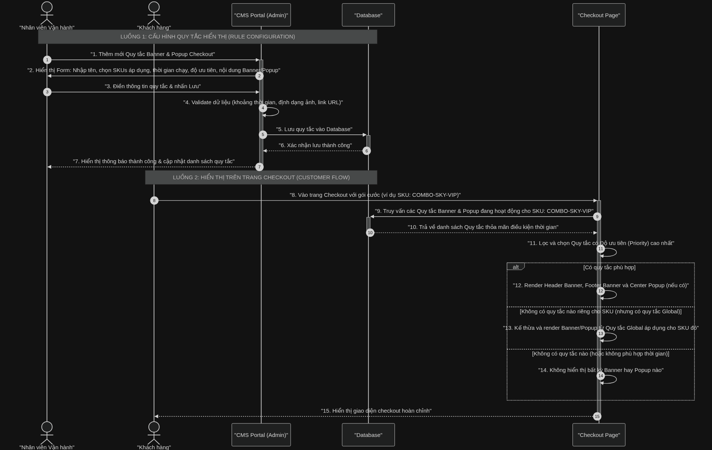
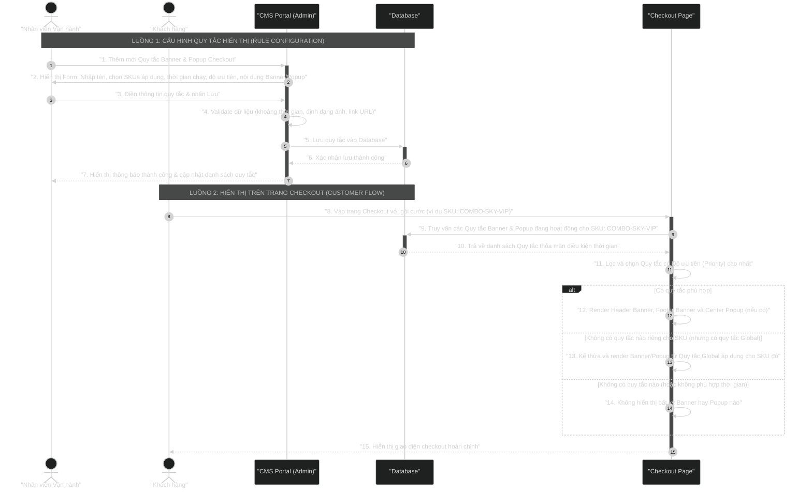

# Sơ đồ Sequence Diagram: Luồng Cấu hình và Hiển thị Banner & Popup Checkout

Dưới đây là sơ đồ trực quan mô tả chi tiết hai luồng hoạt động của tính năng Cấu hình Banner & Popup Checkout theo Quy tắc:
1.  **Luồng cấu hình của Nhân viên Vận hành (VH)** trên hệ thống quản trị CMS.
2.  **Luồng kiểm tra và hiển thị thực tế cho Khách hàng** trên trang Checkout.

## Mã nguồn Mermaid (Dùng để render ảnh)

## Bảng ký hiệu sử dụng trong sơ đồ

| Ký hiệu | Ý nghĩa |
|----------|---------|
| `participant` | Thành phần hệ thống (hộp chữ nhật) |
| `actor` | Người dùng hoặc đối tác bên ngoài (hình người que) |
| `──▶` (`->>`) | Gọi đồng bộ (chờ phản hồi) |
| `╌╌▶` (`-->>`) | Phản hồi / Return |
| `▮ activate/deactivate` | Hộp kích hoạt (đối tượng đang xử lý công việc tích cực) |
| `alt/else/end` | Rẽ nhánh điều kiện (if-else) |
| `Note over` | Ghi chú dải phân cảnh nằm ngang kéo dài qua các lifeline |

## Giải thích luồng nghiệp vụ chi tiết

### 1. Luồng Cấu hình (Quy trình của Vận hành - Steps 1-7)
*   **Bước 1-2**: Nhân viên vận hành (VH) đăng nhập vào CMS Portal, chọn tab "Cấu hình Checkout" và nhấn thêm mới Quy tắc. Form thiết lập hiển thị để VH nhập thông tin.
*   **Bước 3-4**: VH điền đầy đủ các thông tin chiến dịch: chọn danh sách các SKU gói cước áp dụng (ví dụ: chỉ chọn gói Combo Sky VIP), thiết lập khung thời gian chạy (từ ngày/giờ đến ngày/giờ), thiết lập độ ưu tiên của quy tắc, và cấu hình cụm Banner & Popup (upload link ảnh, link điều hướng, đặt thời gian delay/timeout cho popup). CMS sẽ tự động kiểm tra tính hợp lệ của dữ liệu (validate link ảnh, kiểm tra định dạng ngày giờ).
*   **Bước 5-7**: CMS lưu bản ghi quy tắc mới này xuống cơ sở dữ liệu. Sau khi lưu thành công, hệ thống thông báo cho VH và hiển thị bản ghi trên bảng danh sách chiến dịch trong Admin Panel.

### 2. Luồng Hiển thị (Quy trình của Khách hàng - Steps 8-15)
*   **Bước 8-10**: Khách hàng click đăng ký và chuyển hướng vào màn hình Checkout của một gói cước cụ thể. Màn hình Checkout gửi truy vấn về hệ thống để lấy danh sách các cấu hình Banner & Popup phù hợp cho SKU và Kênh bán hiện tại, trong khoảng thời gian đang có hiệu lực.
*   **Bước 11**: Hệ thống phân tích danh sách quy tắc trả về. Nếu có nhiều quy tắc cùng áp dụng cho SKU đó, hệ thống sẽ lọc lấy quy tắc có **Độ ưu tiên (Priority) cao nhất** để hiển thị.
*   **Bước 12-14**: Rẽ nhánh điều kiện hiển thị:
    *   *Có quy tắc phù hợp*: Hiển thị trực tiếp Banner Đầu, Banner Cuối và Center Popup theo cấu hình của chiến dịch đó.
    *   *Kế thừa Global*: Nếu kênh hiện tại không có cấu hình riêng nhưng Global có cấu hình cho SKU đó thì hiển thị cấu hình từ Global.
    *   *Không hiển thị*: Nếu không tìm thấy quy tắc nào hợp lệ và trùng khớp với SKU thì giao diện checkout sẽ trống trơn, không hiển thị Banner & Popup.
*   **Bước 15**: Khách hàng nhìn thấy màn hình Checkout hiển thị chính xác các ưu đãi và thông điệp tương ứng với gói cước mình chọn.
