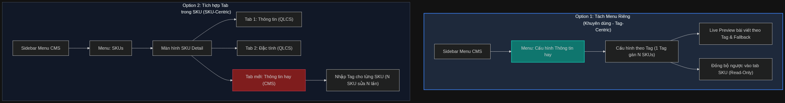

# So sánh kiến trúc thông tin: Menu cấu hình độc lập vs Tab trong SKU

Dưới đây là sơ đồ so sánh cấu trúc luồng vận hành và kiến trúc thông tin (Information Architecture) giữa hai phương án: **Tách menu riêng (Tag-Centric)** và **Gộp vào tab SKU (SKU-Centric)**.

## Mã nguồn Mermaid (Dùng để render ảnh)

```mermaid
%%{init: { 'theme': 'dark' } }%%
graph TD
    subgraph Option1["Option 1: Tách Menu Riêng (Khuyên dùng - Tag-Centric)"]
        MenuCMS1["Sidebar Menu CMS"] --> TagMappingMenu["Menu: Cấu hình Thông tin hay"]
        TagMappingMenu --> TagConfig["Cấu hình theo Tag (1 Tag gán N SKUs)"]
        TagConfig --> Preview["Live Preview bài viết theo Tag & Fallback"]
        TagConfig --> SyncBack["Đồng bộ ngược vào tab SKU (Read-Only)"]
    end
    
    subgraph Option2["Option 2: Tích hợp Tab trong SKU (SKU-Centric)"]
        MenuCMS2["Sidebar Menu CMS"] --> SKUMenu["Menu: SKUs"]
        SKUMenu --> SKUDetail["Màn hình SKU Detail"]
        SKUDetail --> TabInfo["Tab 1: Thông tin (QLCS)"]
        SKUDetail --> TabAttr["Tab 2: Đặc tính (QLCS)"]
        SKUDetail --> TabTag["Tab mới: Thông tin hay (CMS)"]
        TabTag --> InputTag["Nhập Tag cho từng SKU (N SKU sửa N lần)"]
    end

    style Option1 fill:#1e293b,stroke:#3b82f6,stroke-width:2px
    style Option2 fill:#111827,stroke:#4b5563,stroke-width:1px
    style TagMappingMenu fill:#0f766e,stroke:#14b8a6,stroke-width:2px
    style TabTag fill:#7f1d1d,stroke:#f43f5e,stroke-width:1px
```

## Giải thích luồng nghiệp vụ chi tiết & Phân tích so sánh

### Phương án 1: Tách thành Menu cấu hình độc lập (Tag-Centric)
*   **Tiếp cận:** Lấy **Tag** làm trung tâm. Người vận hành định nghĩa một Tag (ví dụ: `camera`), sau đó chọn tất cả các SKU thuộc dòng Camera để gán vào Tag này.
*   **Ưu điểm:**
    *   **Hiệu suất vận hành cao:** Khi có bài viết/tin tức mới về Camera, admin chỉ cần cập nhật tag `camera` một lần duy nhất. Tất cả các SKU liên kết sẽ tự động cập nhật theo mà không cần phải mở từng SKU ra gán.
    *   **Quản lý Fallback tập trung:** Dễ dàng cấu hình logic fallback (nếu một SKU cụ thể không có bài viết riêng thì tự động lấy bài viết chung của tag).
    *   **Trải nghiệm Live Preview trực quan:** Dễ dàng kiểm tra trước (Live Preview) danh sách bài viết nào sẽ xuất hiện cho từng SKU tương ứng.
*   **Nhược điểm:**
    *   Cần thêm một vị trí menu trên Sidebar (tuy nhiên nằm trong phần CMS là hoàn toàn hợp lý).

### Phương án 2: Tích hợp thành một Tab mới trong phần SKUs (SKU-Centric)
*   **Tiếp cận:** Lấy **SKU** làm trung tâm. Admin vào danh sách SKU, chọn từng mã SKU (ví dụ: `CAM-IQ3`, `CAM-SE`, `CAM-SE-F1`), sau đó gán thủ công từng Tag cho SKU đó.
*   **Ưu điểm:**
    *   Giữ sidebar gọn gàng hơn.
*   **Nhược điểm:**
    *   **Vận hành cực kỳ cồng kềnh:** Nếu có 10 SKU camera, admin phải mở 10 màn hình SKU Detail khác nhau chỉ để gán chung một tag hoặc cấu hình cùng một nhóm tin tức. Điều này gây tốn thời gian và dễ sai sót.
    *   **Phức tạp hóa màn hình SKU:** SKU Detail hiện tại vốn đã rất phức tạp với nhiều tab dữ liệu đồng bộ từ QLCS (Thông tin chung, Đặc tính, FAQ, Media). Thêm một tab cấu hình nghiệp vụ CMS trực tiếp sẽ làm mất đi tính rõ ràng giữa dữ liệu đồng bộ (Read-only) và dữ liệu có thể sửa (Editable).
