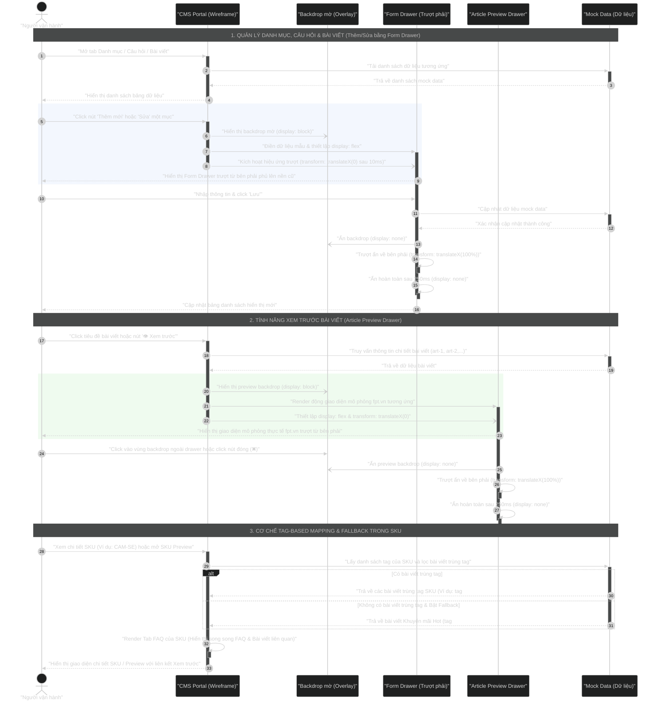

# Sơ đồ Sequence Diagram: Luồng Quản lý và Hiển thị Bài viết & FAQ theo Tag-based Mapping (Với Form Drawer & Article Preview)

Dưới đây là sơ đồ trình tự luồng nghiệp vụ quản lý bài viết/FAQ thông qua các Form Drawer trượt bên phải, tính năng Xem trước Bài viết (Article Preview Drawer) mô phỏng giao diện fpt.vn, cơ chế đồng bộ theo Tag, và quy tắc Fallback khi xem SKU Detail/Preview.

## Mã nguồn Mermaid (Dùng để render ảnh)

## Bảng ký hiệu sử dụng trong sơ đồ

| Ký hiệu | Cú pháp Mermaid | Ý nghĩa |
|:--------:|:----------------|:---------|
| 🧍 Actor | `actor Operator as "Người vận hành"` | Con người tương tác với hệ thống |
| 📦 Participant | `participant CMS as "CMS Portal"` | Thành phần nội bộ hệ thống |
| ──▶ Sync | `A->>B: "msg"` | Gọi đồng bộ — bên gửi **chờ** phản hồi |
| ╌╌▶ Return | `A-->>B: "msg"` | Phản hồi / Trả về kết quả |
| ──▷ Async | `A-)B: "msg"` | Gọi bất đồng bộ — bên gửi **không chờ** (hiệu ứng UI) |
| ↻ Self | `A->>A: "msg"` | Tự gọi xử lý nội bộ |
| ▮ Activate | `+` / `-` hoặc `activate`/`deactivate` | Hộp kích hoạt (đang xử lý tích cực) |
| [alt/else] | `alt ... else ... end` | Rẽ nhánh điều kiện if-else |
| 📝 Note | `Note over A, B: "text"` | Dải phân cảnh / Ghi chú ngang |
| 🟦 Rect | `rect rgba(...) ... end` | Highlight vùng xử lý UI quan trọng |

## Giải thích luồng nghiệp vụ chi tiết

### 1. Quản lý Danh mục, Câu hỏi & Bài viết trong CMS Portal
*   **Bước 1 - 4 (Tải danh sách)**: Người vận hành 🧍 điều hướng qua các tab "Bài viết", "Câu hỏi (FAQ)" hoặc "Danh mục". CMS Portal được **kích hoạt** (▮ activation box) xử lý yêu cầu, gọi đồng bộ (──▶) tới Mock Data để tải dữ liệu, nhận phản hồi (╌╌▶ return) và hiển thị danh sách trên bảng điều khiển.
*   **Bước 5 - 9 (Thêm/Sửa bằng Drawer — Vùng highlight 🟦)**: Khi người vận hành click thêm mới hoặc sửa, hệ thống:
    *   Gửi lệnh **bất đồng bộ** (──▷ async) tới Backdrop để hiển thị mờ ngay lập tức mà không chờ phản hồi.
    *   **Kích hoạt** (▮) Form Drawer bằng lời gọi đồng bộ, sau đó gửi async hiệu ứng trượt CSS.
    *   Drawer trượt mượt mà từ bên phải vào màn hình.
*   **Bước 10 - 16 (Lưu dữ liệu)**: Khi lưu thành công, dữ liệu được ghi đồng bộ vào Mock Data (▮ activate Mock → confirm → deactivate). Backdrop ẩn bằng async (`-)`), Drawer tự gọi (↻ self-message) để trượt ẩn và biến mất. Hộp activation của FormDrawer kết thúc (`deactivate`).

### 2. Tính năng Xem trước Bài viết (Article Preview Drawer)
*   **Bước 17 - 19 (Tải dữ liệu)**: Khi người vận hành muốn kiểm tra giao diện bài viết, CMS được **kích hoạt** (▮), gọi đồng bộ (──▶) tới Mock Data để lấy dữ liệu chi tiết bài viết dựa trên ID.
*   **Bước 20 - 23 (Mở Drawer — Vùng highlight 🟦)**: Hệ thống:
    *   Gửi **async** (──▷) tới Backdrop để hiển thị mờ ngay.
    *   **Kích hoạt** (▮) Article Preview Drawer, render động giao diện mô phỏng `fpt.vn`:
        *   **Camera IQ4S (`art-1`)**: Layout Smart Home cao cấp, tông màu cam/đen.
        *   **Aston Villa (`art-2`)**: Layout báo chí thể thao FPT Play.
        *   **Các bài khác**: Layout mặc định đơn giản.
*   **Bước 24 - 27 (Đóng Drawer)**: Click vùng backdrop → Drawer tự gọi (↻) trượt ẩn, **hủy kích hoạt** (`deactivate`) kết thúc activation box.

### 3. Tự động đồng bộ và Fallback trong SKU Detail & Preview
*   **Bước 28 - 29**: CMS được **kích hoạt** (▮), gọi đồng bộ tới Mock Data (▮ activate) để trích xuất Tag của SKU.
*   **Bước 30 - 31 (Rẽ nhánh `alt`/`else`)**: 
    *   ✅ **Nhánh 1 (alt)**: Có bài viết trùng tag → trả về bài viết trùng tag.
    *   🔄 **Nhánh 2 (else)**: Không trùng tag + Fallback bật → trả về bài Khuyến mãi Hot (`#khuyenmai`).
*   **Bước 32 - 33**: CMS tự gọi (↻ self-message) render Tab FAQ, sau đó trả kết quả (╌╌▶ return) cho Operator và **hủy kích hoạt** (`-`).
