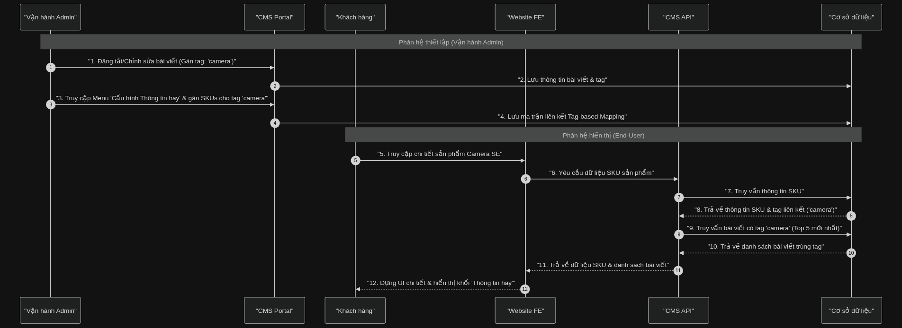
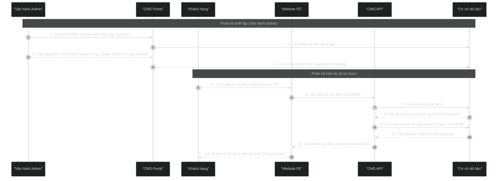

# Sơ đồ Sequence Diagram: Hiển thị Block "Thông tin hay" theo Tag sản phẩm

Dưới đây là sơ đồ trực quan luồng tự động hiển thị bài viết liên quan (Thông tin hay) dựa trên Tag sản phẩm, cập nhật theo cơ chế cấu hình tập trung mới.

## Mã nguồn Mermaid (Dùng để render ảnh)

## Giải thích luồng nghiệp vụ chi tiết

### 1. Phân hệ thiết lập (Vận hành Admin)
*   **Bước 1 - 2:** Khi Vận hành đăng tải hoặc chỉnh sửa bài viết trong module Quản lý Bài viết & FAQ, họ sẽ gán các tag có liên quan. Ví dụ: một bài viết về đánh giá camera sẽ được đánh tag "camera". Hệ thống lưu thông tin bài viết kèm tag vào DB.
*   **Bước 3 - 4:** Tại menu **Cấu hình Thông tin hay** tập trung dưới CMS, Vận hành chọn tag "camera" và tick chọn liên kết các SKU dòng sản phẩm tương ứng (ví dụ: `CAM-IQ3`, `CAM-SE`), bật/tắt logic Fallback. Hệ thống ghi nhận ma trận mapping này vào DB và tự động đồng bộ hai chiều.

### 2. Phân hệ hiển thị (End-User)
*   **Bước 5 - 6:** Khách hàng truy cập trang chi tiết sản phẩm Camera SE. Trình duyệt gửi yêu cầu lấy dữ liệu chi tiết sản phẩm tới CMS API.
*   **Bước 7 - 8:** API truy xuất thông tin SKU từ DB, lấy ra được các tag liên kết là "camera".
*   **Bước 9 - 10:** CMS API thực hiện truy vấn thứ hai tới DB để tìm kiếm các bài viết được đánh tag "camera", sắp xếp theo thời gian mới nhất và giới hạn tối đa 5 bài viết.
*   **Bước 11 - 12:** API tổng hợp thông tin SKU và danh sách bài viết trùng tag trả về cho Website FE. Giao diện dựng hoàn chỉnh thông số sản phẩm và khối Sticky "Thông tin hay" hiển thị dọc trang.
