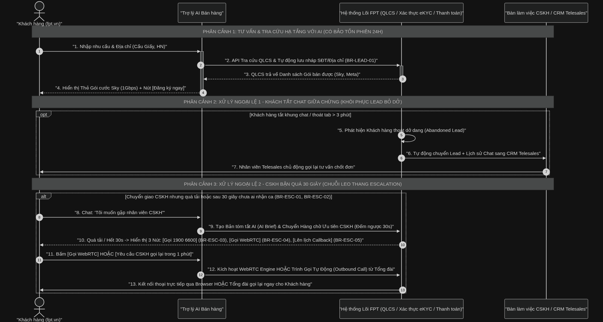
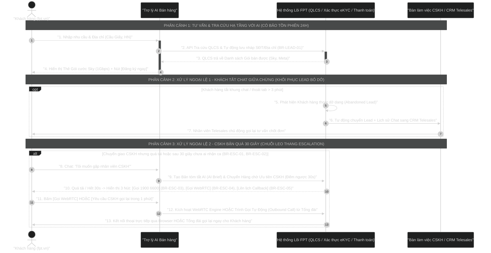

# Tài Liệu Đặc Tả Nghiệp Vụ & Sơ Đồ Sequence Diagram: Trợ Lý AI Bán Hàng Tự Động & Chuyển Giao CSKH (FPT AI Sales Chatbot)

Tài liệu đặc tả toàn diện ngữ cảnh Mục tiêu & Bối cảnh Kinh doanh (Business Case), Chỉ số Đo lường (KPIs), Luồng Nghiệp vụ (Business Flow), Tập Quy tắc Nghiệp vụ (Business Rules), Đặc tả Kỹ thuật API (Functional Specs) và Khung Giao diện (UI/UX Mockups) cho giải pháp **Trợ lý AI Bán hàng Tự động & Chuyển giao CSKH trên Kênh Số fpt.vn**.

---

## 0. Bảng Diễn Giải Thuật Ngữ Nghiệp Vụ & Kỹ Thuật (Tiếng Việt Dễ Hiểu)

Dưới đây là bảng giải thích chi tiết ý nghĩa bằng Tiếng Việt cho toàn bộ các từ tiếng Anh và từ viết tắt chuyên ngành trong tài liệu:

| Thuật ngữ / Từ viết tắt | Tên Tiếng Anh | Diễn giải Tiếng Việt thuần túy (Giải thích dễ hiểu) |
|---|---|---|
| **Business Case** | Business Case | **Bối cảnh & Lý do đầu tư**: Lý do vì sao dự án cần được làm và giá trị mang lại cho doanh nghiệp. |
| **Business Goal / KPIs** | Business Goal / Key Performance Indicators | **Mục tiêu & Chỉ số đo lường thành công**: Các con số mục tiêu cần đạt được (như tăng 35% doanh số). |
| **Business Flow** | Business Flow | **Luồng nghiệp vụ**: Trình tự các bước tương tác giữa người dùng và các hệ thống. |
| **Business Rules (BR)** | Business Rules | **Quy tắc nghiệp vụ**: Các điều kiện và quy định bắt buộc hệ thống phải tuân theo. |
| **QLCS** | Core Infrastructure Database | **Hệ thống Quản lý Cáp & Số**: Dữ liệu lõi của FPT quản lý tủ cáp, số lượng cổng mạng khả dụng tại từng địa chỉ. |
| **NLU** | Natural Language Understanding | **Bộ Hiểu Ngôn ngữ Tự nhiên**: Phần mềm AI đọc hiểu câu chat tiếng Việt, bóc tách ra SĐT và Địa chỉ khách hàng. |
| **Abandoned Lead** | Abandoned Lead | **Thông tin Khách thoát dở dang**: Khách đã điền SĐT/Địa chỉ nhưng tắt tab/thoát chat trước khi chốt đơn. |
| **AI Brief Summary** | AI Brief Summary | **Bản Tóm tắt Hội thoại AI**: Đoạn tóm tắt 3 dòng do AI tự viết để báo cho nhân viên biết khách đang cần gì. |
| **Outbound Call Engine** | Outbound Call Engine | **Trình Gọi Tự Động từ Tổng đài**: Hệ thống tự động thực hiện cuộc gọi từ tổng đài gọi lại cho SĐT khách hàng. |
| **SLA** | Service Level Agreement | **Cam kết thời gian phản hồi**: Thời gian giới hạn tối đa hệ thống phải xử lý xong (như đếm ngược 30 giây). |
| **CSAT** | Customer Satisfaction Score | **Mức độ hài lòng của khách hàng**: Chỉ số đánh giá khách hàng có vui vẻ với dịch vụ hay không. |
| **Sentiment Analysis** | Sentiment Analysis | **Phân tích Cảm xúc Người dùng**: AI đọc câu chat để biết khách đang vui, bình thường hay bức xúc/tức giận. |
| **Telesales CRM Console** | Telesales CRM Console | **Màn hình làm việc của Nhân viên Bán hàng**: Giao diện để nhân viên nhận thông tin khách và bấm gọi chốt đơn. |
| **WebRTC Call** | WebRTC In-Browser Direct Call | **Gọi thoại trực tiếp trên Web**: Khách bấm nút gọi trực tiếp từ trình duyệt web mà không tốn tiền cước điện thoại. |
| **Callback Scheduling** | Callback Scheduling | **Lên lịch hẹn gọi lại**: Khách hẹn khung giờ rảnh để nhân viên chủ động gọi lại tư vấn. |
| **TTL** | Time To Live | **Thời hạn tồn tại dữ liệu**: Thời gian lưu dữ liệu tạm (ví dụ: lưu thông tin chat trong 24 giờ). |

---

## 1. Business Case (Bối Cảnh & Lý Do Đầu Tư Nghiệp Vụ)

### 1.1. Thực trạng & Điểm nghẽn (AS-IS Pain Points)
- **Tỷ lệ rớt đơn trên Web (High Abandonment Rate - Tỷ lệ thoát dở dang cao):** Hơn 45% người dùng ghé thăm trang web `fpt.vn` có nhu cầu lắp đặt Internet/Truyền hình thoát trang giữa chừng khi gặp các biểu mẫu đăng ký dài hoặc chưa biết hạ tầng khu vực có đáp ứng gói cước mong muốn hay không.
- **Tải trọng Tổng đài Giờ cao điểm (Peak Hours Overload):** Tổng đài CSKH 1900 6600 thường xuyên quá tải giờ cao điểm. Khách hàng phải chờ kết nối nhân viên tư vấn trung bình 45 - 90 giây, gây bất mãn và giảm chỉ số hài lòng (CSAT).
- **Lãng phí Lead tư vấn dở dang (Lost Draft Leads):** Các thông tin địa chỉ/SĐT do khách nhập trên khung chat nhưng thoát trước khi chốt đơn bị thất thoát, không được ghi nhận và phân bổ kịp thời cho lực lượng Telesales (Bán hàng qua điện thoại) / Kinh doanh khu vực.

### 1.2. Giải pháp Đề xuất (TO-BE Solution)
Đầu tư triển khai **Trợ lý AI Bán hàng Tự động (FPT AI Sales Assistant)** kết hợp cơ chế **Chuyển giao CSKH Thông minh (Smart CSKH Handoff & Outbound Call - Tự động gọi lại)**:
- Khả năng hiểu ngôn ngữ tự nhiên (NLU - Natural Language Understanding tiếng Việt), tự động bóc tách Địa chỉ & SĐT.
- Tích hợp trực tiếp hệ thống Lõi QLCS (Quản lý Cáp & Số) để tra cứu hạ tầng khả dụng và hiển thị thẻ gói cước cá nhân hóa thời gian thực.
- Khôi phục Lead bỏ dở (Abandoned Lead Recovery - Ghi nhận khách thoát giữa chừng) tự động sau 3 phút thoát chat, đồng bộ (sync) trực tiếp dữ liệu kèm AI Chat Summary (Tóm tắt hội thoại AI) sang Telesales CRM.
- Hàng chờ ưu tiên CSKH có đếm ngược SLA (Cam kết thời gian xử lý) 30s. Nếu CSKH quá tải quá 30s, tự động kích hoạt **Outbound Call Engine (Trình Gọi Ra Tự Động 1-Minute Callback)** kết nối trực tiếp tổng đài gọi lại cho khách.

---

## 2. Business Goal & KPIs (Mục Tiêu Kinh Doanh & Chỉ Số Đánh Giá)

### 2.1. Mục tiêu Chiến lược
1. **Tăng trưởng Doanh số Online:** Nâng tỷ lệ chuyển đổi (Conversion Rate - Tỷ lệ khách chốt đơn) từ khách truy cập web thành đơn hàng hoàn tất lên **+35%**.
2. **Tối ưu Thời gian Phản hồi:** Giảm thời gian chờ hỗ trợ của khách hàng từ 90 giây xuống dưới **5 giây** với AI Chatbot và dưới **30 giây** khi yêu cầu gặp CSKH.
3. **Giảm tải Tổng đài CSKH:** Tự động hóa **50%** các câu hỏi tra cứu gói cước & hạ tầng cơ bản mà không cần con người can thiệp.
4. **Tối đa hóa Giá trị Lead:** Khôi phục **25 - 30%** các Lead tư vấn dở dang thông qua lực lượng Telesales chăm sóc lại trong vòng 24h.

### 2.2. Khung Chỉ số KPI Đo lường (Metrics Framework)

| Tên KPI (Tiếng Anh) | Diễn giải Tiếng Việt & Công thức tính | Target chỉ số |
|---|---|---|
| **Chatbot Conversion Rate (CR)** | Tỷ lệ chuyển đổi chốt đơn thành công qua AI Chatbot / Tổng số user mở widget chat | **≥ 18%** |
| **Abandoned Lead Recovery Rate** | Tỷ lệ khôi phục chốt đơn thành công từ các Lead thoát dở dang trong vòng 24h | **≥ 25%** |
| **CSKH Escalation SLA (30s)** | Tỷ lệ yêu cầu chuyển CSKH được nhân viên bấm nhận ca trong vòng 30 giây đếm ngược | **≥ 85%** |
| **1-Minute Callback SLA** | Thời gian tổng đài tự động thực hiện cuộc gọi lại tới SĐT khách hàng sau khi bấm yêu cầu | **≤ 60 giây** |
| **QLCS API Latency** | Thời gian phản hồi API tra cứu hạ tầng QLCS và trả về kết quả gói cước | **≤ 1,5 giây** |

---

## 3. Business Flow & Sequence Diagram (Luồng Nghiệp Vụ & Sơ Đồ Chi Tiết)

Dưới đây là sơ đồ tương tác tuần tự thuần Việt giữa Khách hàng trên `fpt.vn`, Trợ lý AI Bán hàng, Hệ thống lõi FPT (QLCS/eKYC/Thanh toán), và Bàn làm việc CSKH / CRM Telesales.



### 3.1. Mã nguồn Mermaid (Bảo toàn & Chuẩn hóa)



### 3.2. Bảng ký hiệu sử dụng trong sơ đồ

| Ký hiệu | Ý nghĩa nghiệp vụ | Cú pháp Mermaid |
|---|---|---|
| `actor` | Khách hàng tương tác trực tiếp trên giao diện Web `fpt.vn` | `actor Customer` |
| `participant` | Các dịch vụ/hệ thống (AI Chatbot, Hệ thống Lõi FPT, Telesales CRM/CSKH Desk) | `participant Name` |
| `->>` | Gọi API / Tin nhắn đồng bộ (Synchronous Request) | `A->>B: "Msg"` |
| `-->>` | Phản hồi dữ liệu / Trả kết quả (Return Response) | `B-->>A: "Data"` |
| `-)` | Sự kiện bất đồng bộ / Push Notification | `A-)B: "Event"` |
| `Note over` | Phân đoạn phân cảnh nghiệp vụ trải dài qua các thực thể | `Note over A, B` |
| `opt / end` | Ngoại lệ tùy chọn (Khách tắt chat giữa chừng > 3 phút) | `opt ... end` |
| `alt / else / end` | Rẽ nhánh xử lý ngoại lệ (CSKH bận quá 30 giây) | `alt ... end` |

---

## 4. Giải Thích Luồng Nghiệp Vụ Chi Tiết (Detailed Flow Walkthrough)

### 4.1. Phân cảnh 1: Tư vấn & Tra cứu Hạ tầng với AI (Bảo tồn phiên 24h)
- **Bước 1 - 2:** Khách hàng nhập địa chỉ (ví dụ: *"Cầu Giấy, Hà Nội"*) và SĐT liên hệ vào khung Chatbot. AI Chatbot kích hoạt NLU bóc tách entity địa chỉ và gọi API kiểm tra hạ tầng QLCS. Đồng thời, hệ thống ghi nhận bản ghi Lead Nháp (Draft Lead) lưu vào DB kèm `session_id` với thời gian sống (TTL) 24 giờ (`BR-LEAD-01`).
- **Bước 3 - 4:** QLCS đối soát tọa độ/địa chỉ, trả về danh sách các gói cước Internet có cổng khả dụng (Giga 150Mbps, Sky 1Gbps, Meta 1Gbps). AI Chatbot phân tích nhu cầu và render **Thẻ Gói Cước Tương Tác (Interactive Product Card)** với gói **Sky (1Gbps)** kèm chi tiết cước phí, khuyến mãi và nút hành động `[Đăng ký ngay]`.

### 4.2. Phân cảnh 2: Ngoại lệ 1 - Khôi phục Lead Bỏ Dở (Abandoned Lead Recovery)
- **Bước 5:** Nếu khách hàng ngừng tương tác, đóng khung chat hoặc thoát khỏi trang web > 3 phút sau khi đã cung cấp SĐT/Địa chỉ nhưng chưa bấm `[Đăng ký ngay]`.
- **Bước 6 - 7:** Job Scheduler trên Backend tự động chuyển trạng thái Lead sang `ABANDONED_LEAD`. AI Engine tổng hợp tóm tắt nội dung trao đổi (AI Brief Summary) và tự động push sang **Telesales CRM Console** theo phân vùng địa lý (Khu vực Hà Nội 1). Nhân viên Telesales nhận notification và chủ động thực hiện cuộc gọi chăm sóc chốt đơn cho khách (`BR-LEAD-02`).

### 4.3. Phân cảnh 3: Ngoại lệ 2 - Chuỗi Leo thang Khẩn cấp khi CSKH Quá Tải (Escalation Chain)
- **Bước 8 - 9:** Khách hàng gõ cụm từ yêu cầu tư vấn viên con người (ví dụ: *"Tôi muốn gặp nhân viên CSKH"*). AI Chatbot trích xuất 3 dòng tóm tắt nhu cầu, đẩy hội thoại vào **Hàng chờ Ưu tiên CSKH (Priority Queue)** và kích hoạt đồng hồ đếm ngược 30 giây (`BR-ESC-02`).
- **Bước 10:** Khi phát hiện CSKH quá tải (`BR-ESC-01`) hoặc hết 30 giây đếm ngược mà không có Agent nhận ca, hệ thống tự động hủy hàng chờ và hiển thị các phương án cấp cứu:
  1. **[Gọi Hotline 1900 6600]** (`BR-ESC-03`): Tự động kích hoạt cuộc gọi tới đường dây nóng CSKH 1900 6600.
  2. **[Kết nối WebRTC Call]** (`BR-ESC-04`): Cuộc gọi thoại trực tiếp qua trình duyệt web không cần cài ứng dụng (ưu tiên khi tổng đài bận/khách ở nước ngoài).
  3. **[Yêu cầu CSKH gọi lại trong 1 phút / Lên lịch Callback]** (`BR-ESC-05`): Ghi nhận yêu cầu gọi lại và đẩy tác vụ ưu tiên sang Telesales CRM.
- **Bước 11 - 13:** Khách hàng bấm lựa chọn. AI Chatbot kích hoạt Engine xử lý tương ứng (WebRTC Audio Server hoặc Outbound Call Engine từ Tổng đài VoIP) kết nối ngay lập tức tới Khách hàng.

---

## 5. Business Rules - Tập Quy Tắc Nghiệp Vụ Chi Tiết

### 5.1. Nhóm Quy tắc Quản lý & Khôi phục Lead (Lead Management Rules)

| Mã Quy tắc | Tên Quy tắc | Mô tả chi tiết & Logic xử lý | Điều kiện kích hoạt |
|---|---|---|---|
| **BR-LEAD-01** | **Tự động Lưu nháp & Bảo tồn Session 24h** | Mọi thông tin SĐT, Địa chỉ, Nhu cầu khách nhập trên Chatbot phải được lưu nháp lập tức vào DB kèm `session_id` (cookie/local storage). Nếu khách F5 hoặc quay lại web trong 24h, Chatbot tự động khôi phục ngữ cảnh trò chuyện. | Ngay khi trích xuất thành công SĐT ($\ge 10$ chữ số) |
| **BR-LEAD-02** | **Phân bổ Abandoned Lead cho Telesales CRM** | Khi phiên chat không có tương tác hoặc bị đóng $> 3$ phút mà chưa hoàn tất Order, hệ thống đổi trạng thái thành `ABANDONED_LEAD`. Phân bổ cho Telesales CRM theo quy tắc Routing khu vực địa lý (Ví dụ: Địa chỉ Cầu Giấy $\rightarrow$ Team Telesales HN1). | Idle time $> 180$s & Đã có SĐT & Chưa tạo Order |

### 5.2. Nhóm Quy tắc Leo thang Chuyển giao CSKH (Smart Escalation Rules)

| Mã Quy tắc | Tên Quy tắc | Mô tả chi tiết & Logic xử lý | Điều kiện kích hoạt |
|---|---|---|---|
| **BR-ESC-01** | **Phát hiện Quá tải (Overload Detection)** | Khi hàng đợi CSKH vượt ngưỡng cho phép (Ví dụ: $> 20$ khách chờ hoặc 0 Agent trực rảnh), hệ thống tự động kích hoạt chế độ quá tải và thông báo cho Chatbot để chuyển hướng xử lý. | Hàng chờ CSKH $> Threshold$ OR 0 Agent rảnh |
| **BR-ESC-02** | **Đếm ngược SLA 30 giây (30s SLA Countdown)** | Sau khi khách hàng yêu cầu hỗ trợ (hoặc AI kích hoạt tự động khi phát hiện Sentiment tiêu cực/bức xúc 3 lần liên tiếp: `negative_sentiment_count >= 3`), hệ thống bắt đầu đếm ngược 30 giây. Nếu hết 30 giây mà không có nhân viên CSKH tiếp nhận ca, tự động chuyển sang bước leo thang tiếp theo: **Tự động hủy hàng chờ và hiển thị 3 phương án cấp cứu trên UI để khách lựa chọn: (1) Gọi Hotline 1900 6600 (BR-ESC-03), (2) Gọi thoại trực tiếp WebRTC (BR-ESC-04), hoặc (3) Lên lịch Callback CRM (BR-ESC-05)**. | Khách yêu cầu CSKH OR Intent `request_agent` OR `negative_sentiment_count >= 3` |
| **BR-ESC-03** | **Gọi Tổng đài 1900 6600 (Hotline Connection)** | Khi SLA 30 giây hết hạn và CSKH vẫn quá tải, Chatbot cung cấp nút bấm kết nối trực tiếp đến Tổng đài 1900 6600 để khách hàng được hỗ trợ ngay lập tức. | Hết SLA 30s & CSKH quá tải |
| **BR-ESC-04** | **Kết nối WebRTC Call (In-Browser Direct Call)** | Hỗ trợ gọi thoại trực tiếp qua trình duyệt bằng công nghệ WebRTC, không cần cài ứng dụng. Ưu tiên dùng khi đường dây tổng đài bận hoặc khách hàng truy cập ở nước ngoài / không có sóng viễn thông. | Đường dây tổng đài bận OR Khách chọn WebRTC |
| **BR-ESC-05** | **Lên lịch Callback (CRM Telesales Queue)** | Nếu khách hàng không thể chờ, hệ thống ghi nhận yêu cầu gọi lại (1-Minute Callback hoặc hẹn giờ) và đẩy tác vụ vào hàng đợi Telesales CRM để nhân viên liên hệ trong khung giờ phù hợp. | Action Click `[Yêu cầu Gọi lại]` |

### 5.3. Mô hình Cơ Chế Leo Thang Chuyển Giao CSKH Tổng Thể (Overall Escalation Chain)

Chuỗi leo thang liền mạch được vận hành theo quy trình khép kín:

> **Chuỗi Leo Thang khép kín**: Chatbot Tự Xử Lý ──> Khách Yêu Cầu Hỗ Trợ ──> Đếm Ngược SLA 30 Giây ──> CSKH Quá Tải / Hết Giờ ──> Gọi Hotline 1900 6600 / Gọi Thoại WebRTC ──> Lên Lịch Gọi Lại ──> CRM Nhân Viên Bán Hàng

- **Đảm bảo:** 100% không gián đoạn dịch vụ, khách hàng luôn có kênh liên lạc phù hợp ngay cả trong tình huống đỉnh điểm quá tải tổng đài.

### 5.4. Quy Tắc Phân Tích Cảm Xúc & Ngưỡng Kích Hoạt (Sentiment Analysis & Frustration Threshold Matrix)

Hệ thống AI Chatbot tự động tính toán chỉ số bức xúc (Frustration Score) và cập nhật biến đếm cảm xúc tiêu cực (`negative_sentiment_count`) theo các quy tắc sau:

1. **Bộ chỉ báo Tiêu cực (Negative Sentiment Indicators)**:
   - **Từ ngữ bức xúc / Phàn nàn**: *"chậm quá", "như rùa", "lừa đảo", "làm ăn kém", "bận hoài", "phục vụ tệ", "bất mãn"*.
   - **Định dạng văn bản**: Khách nhắn câu bằng chữ IN HOA toàn bộ (ví dụ: `LÀM ĂN KIỂU GÌ VẬY`), hoặc chèn lặp lại nhiều dấu chấm cảm/hỏi liên tiếp (`???`, `!!!`).
   - **Hành vi lặp câu hỏi (Looping Behavior)**: Khách nhập lặp lại cùng 1 ý định 3 lần liên tiếp mà Chatbot trả lời chưa giải quyết được vướng mắc.
2. **Logic Cộng điểm & Tăng Biến đếm (`negative_sentiment_count`)**:
   - Mỗi tin nhắn gửi lên được phân tích qua NLP Model. Nếu điểm cảm xúc `sentiment_score < -0.6`, hệ thống tự động tăng `negative_sentiment_count += 1`.
3. **Ngưỡng kích hoạt Chuyển giao Khẩn cấp (`negative_sentiment_count >= 3`)**:
   - Ngay khi `negative_sentiment_count` đạt mốc **3 lần liên tiếp**, AI tự động ngắt kịch bản tự động, tự tổng hợp **AI Brief Summary** (bản tóm tắt lý do bức xúc của khách) và chuyển thẳng vào **Hàng chờ Ưu tiên CSKH kèm Đếm ngược SLA 30s (`BR-ESC-02`)**.

---

## 6. Đặc Tả Chi Tiết Chức Năng & API Integration Specs

### 6.1. Danh mục API Tích hợp Lõi

#### 1. API Tra cứu QLCS & Lưu Nháp Lead
- **Endpoint:** `POST /api/v1/chatbot/infrastructure-check`
- **Request Payload:**
```json
{
  "session_id": "SESS-FPT-88912304",
  "phone_number": "0987654321",
  "address_raw": "Số 10 Phạm Văn Đồng, Phường Dịch Vọng Hậu, Cầu Giấy, Hà Nội",
  "user_intent": "Lắp internet gia đình xem phim 4K"
}
```
- **Response Payload:**
```json
{
  "status": "SUCCESS",
  "lead_draft_id": "LD-20260803-9912",
  "infrastructure": {
    "is_available": true,
    "cabinet_code": "CGY-POP-04",
    "port_available": 12
  },
  "recommended_packages": [
    {
      "package_code": "SKY_1G",
      "package_name": "Gói Sky (1Gbps)",
      "bandwidth": "1 Gbps Download",
      "price_monthly": 225000,
      "promotion": "Tặng 01 tháng cước + Miễn phí Modem Wi-Fi 6"
    }
  ]
}
```

#### 2. API Khôi Phục Lead Bỏ Dở (Push sang Telesales CRM)
- **Endpoint:** `POST /api/v1/crm/telesales/abandoned-lead`
- **Request Payload:**
```json
{
  "lead_draft_id": "LD-20260803-9912",
  "customer_name": "Khách hàng Web (Khôi phục)",
  "phone_number": "0987654321",
  "area_code": "HN1",
  "ai_brief_summary": "- Nhu cầu: Lắp Internet Cầu Giấy\n- Gói tư vấn: Sky (1Gbps)\n- Trạng thái: Tắt web khi đang xem bảng giá",
  "abandoned_at": "2026-08-03T11:05:00Z"
}
```

#### 3. API Outbound Call Engine (VIP 1-Minute Callback)
- **Endpoint:** `POST /api/v1/outbound-call/trigger-callback`
- **Request Payload:**
```json
{
  "session_id": "SESS-FPT-88912304",
  "phone_number": "0987654321",
  "callback_type": "URGENT_1MIN",
  "context_summary": "Khách yêu cầu hỗ trợ gấp do CSKH chat bận quá 30s. Cần tư vấn gói Sky Cầu Giấy."
}
```

### 6.2. Các Phương Pháp Tích Hợp AI Phân Tích Cảm Xúc & Phát Hiện Bức Xúc (5 Phương Pháp Thực Thi)

Trong các hệ thống Chatbot doanh nghiệp thực tế hiện nay (như FPT Telecom), việc nhận diện mức độ không hài lòng / bức xúc của khách hàng được tích hợp theo 5 phương pháp chính sau:

| STT | Phương pháp tích hợp AI | Nguyên lý hoạt động (Tiếng Việt dễ hiểu) | Ưu điểm & Điểm tối ưu |
|---|---|---|---|
| **1** | **Trí tuệ nhân tạo thế hệ mới (Mô hình Ngôn ngữ Lớn - LLM)** *(Khuyên dùng)* | Mỗi khi khách nhắn tin, AI thế hệ mới tự động phân tích ngữ cảnh và trả về dữ liệu cho biết thái độ khách (*Hài lòng, Bình thường, hoặc Bức xúc*) kèm điểm số bức xúc ($0-100$). | Hiểu cực tốt tiếng Việt, tiếng lóng, mỉa mai, từ viết tắt (*vcl, rùa bò, làm ăn kém*). |
| **2** | **Bộ phân loại cảm xúc siêu tốc (PhoBERT NLP)** | Sử dụng phần mềm AI chuyên biệt nhỏ chạy trước khi vào Chatbot, phân tích cảm xúc câu chat trong dưới 0,05 giây ($<50\text{ms}$). | Phản hồi siêu tốc, tiết kiệm $90\%$ chi phí máy chủ và không gây trễ cuộc chat. |
| **3** | **Bộ máy Giám sát ca tự động (Multi-Agent Supervisor)** | Sử dụng một AI đóng vai "Giám sát viên". AI này theo dõi cuộc trò chuyện: nếu thấy khách lặp lại câu hỏi 3 lần không được giải quyết hoặc bức xúc tăng dần, AI tự ngắt bot và chuyển cho nhân viên con người. | Đảm bảo an toàn, tự động chuyển nhân viên ngay khi AI trả lời không đáp ứng được nhu cầu khách. |
| **4** | **Nhận diện cảm xúc qua giọng nói (Speech Emotion Recognition)** | Áp dụng khi khách gọi thoại trực tiếp. AI phân tích âm điệu giọng nói, tốc độ nói và độ to nhỏ (âm lượng) theo thời gian thực. | Nhận diện ngay khi khách bắt đầu quát mắng hoặc nói dồn dập trong cuộc gọi thoại để chuyển máy cho nhân viên. |
| **5** | **Bộ lọc từ ngữ vi phạm & Quy tắc cơ bản (Blacklist Filter)** | Tích hợp bộ lọc từ cấm, nhận diện câu chữ IN HOA toàn bộ hoặc dấu chấm cảm/hỏi liên tiếp (`???`, `!!!`) làm lớp bảo vệ đầu tiên. | Xử lý ngay lập tức ($0\text{ms}$ delay), chặn ngay các câu từ vi phạm chuẩn mực văn hóa. |

### 6.3. Kiến Trúc & Phương Pháp Tích Hợp AI 5 Tầng Toàn Diện Cho Hệ Thống Chatbot FPT

Hệ thống **Trợ lý AI Bán hàng FPT** được xây dựng theo **Mô hình Tích hợp AI 5 Tầng** kết hợp giữa Trí tuệ nhân tạo thế hệ mới, Phần mềm đọc hiểu tiếng Việt và Hệ thống Tự động Chuyển giao CSKH:

```
+-----------------------------------------------------------------------------------+
| TẦNG 1: CỔNG TIẾP NHẬN & BỘ LỌC BẢO VỆ (Lọc từ cấm, Đọc cảm xúc siêu tốc <0,05s)  |
+-----------------------------------------------------------------------------------+
                                         │
                                         ▼
+-----------------------------------------------------------------------------------+
| TẦNG 2: BÓC TÁCH Ý ĐỊNH & THỰC THỂ (Rút tự động SĐT, Địa chỉ, Nhu cầu gói cước)   |
+-----------------------------------------------------------------------------------+
                                         │
                                         ▼
+-----------------------------------------------------------------------------------+
| TẦNG 3: TRỢ LÝ AI BÁN HÀNG & TRA CỨU HẠ TẦNG (Tra QLCS API, Gợi ý Thẻ Gói Sky/Meta)|
+-----------------------------------------------------------------------------------+
                                         │
                                         ▼
+-----------------------------------------------------------------------------------+
| TẦNG 4: GIÁM SÁT CA & QUẢN LÝ PHIÊN (Bảo tồn phiên 24h, Khách bức xúc 3 lần ngắt)|
+-----------------------------------------------------------------------------------+
                                         │
                                         ▼
+-----------------------------------------------------------------------------------+
| TẦNG 5: CHUYỂN GIAO LEO THANG CSKH (Gọi thoại WebRTC, Gọi tự động 1 phút, CRM)    |
+-----------------------------------------------------------------------------------+
```

#### Chi tiết vai trò & phương pháp tích hợp của từng tầng AI (Giải thích dễ hiểu):

1. **Tầng 1 - Cổng Tiếp Nhận & Bộ Lọc Bảo Vệ (Gateway Layer)**:
   - **Công nghệ sử dụng**: Cổng nhận tin nhắn kết hợp **Bộ phân loại cảm xúc PhoBERT** (xử lý dưới 0,05 giây) và **Bộ lọc từ ngữ vi phạm chuẩn mực**.
   - **Cách thức vận hành**: Nhận diện thái độ khách và chặn ngay các câu từ chửi bới/xúc phạm trước khi chuyển tin nhắn cho AI xử lý tiếp, giúp hệ thống phản hồi tức thì và tiết kiệm chi phí vận hành máy chủ.

2. **Tầng 2 - Hiểu Ý Định & Bóc Tách Thông Tin (FPT-NLU Layer)**:
   - **Công nghệ sử dụng**: Phần mềm **FPT-NLU** được huấn luyện riêng cho từ ngữ viễn thông Tiếng Việt.
   - **Cách thức vận hành**: Tự động nhận diện chính xác Số điện thoại ($\ge 10$ chữ số), Địa chỉ chi tiết (Cầu Giấy, Hà Nội) và Nhu cầu khách hàng (Xem phim 4K, chơi Game, lắp Camera gia đình).

3. **Tầng 3 - Trợ Lý AI Bán Hàng & Gọi Hệ Thống Lõi (LLM Sales Agent Layer)**:
   - **Công nghệ sử dụng**: Mô hình **Trí tuệ nhân tạo thế hệ mới (FPT-LLM)** có khả năng tự động thực thi tác vụ.
   - **Cách thức vận hành**: AI tự động gọi sang hệ thống Lõi Quản lý Cáp & Số QLCS để kiểm tra tủ cáp tại Cầu Giấy, sau đó vẽ thẻ gói cước Sky (1Gbps) đẹp mắt cho khách xem kèm điểm số bức xúc (nếu có).

4. **Tầng 4 - Giám Sát Ca & Quản Lý Trạng Thái (Multi-Agent Supervisor Layer)**:
   - **Công nghệ sử dụng**: Mô hình **AI Giám sát viên độc lập** và **Cơ sở dữ liệu lưu tạm phiên 24h**.
   - **Cách thức vận hành**: Đếm số lần khách bức xúc (`negative_sentiment_count`). Ngay khi khách bức xúc 3 lần hoặc gõ "gặp nhân viên", AI Giám sát viên ngắt quyền Chatbot, tự viết **Bản tóm tắt AI (3 dòng)** và đẩy ca sang Hàng chờ Ưu tiên CSKH (đếm ngược 30s). Đồng thời phát hiện khách tắt chat quá 3 phút để gửi sang phần mềm CRM cho nhân viên Telesales gọi lại.

5. **Tầng 5 - Chuyển Giao CSKH & Kết Nối Tổng Đài (Escalation Handoff Layer)**:
   - **Công nghệ sử dụng**: **Trình gọi thoại trực tiếp trên Web (WebRTC)** và **Hệ thống Tổng đài Gọi tự động (VoIP SIP)**.
   - **Cách thức vận hành**: Khi CSKH bận quá 30 giây, kích hoạt ngay 3 tùy chọn cứu hộ: gọi thoại trực tiếp qua trình duyệt web miễn phí, gọi hotline 1900 6600, hoặc hẹn lịch tổng đài tự động gọi lại vào SĐT khách hàng trong 60 giây.

---

## 7. UI/UX Wireframe & Mockups Chi Tiết (Giao Diện Đa Trạng Thái)

Theo định hướng thiết kế **Designer Skill**, dưới đây là bản mô phỏng giao diện wireframe trực quan đa trạng thái của Widget Trợ lý AI Bán hàng trên `fpt.vn` và Giao diện Bàn làm việc Telesales CRM (được thu gọn vừa khít lề A4):

### 7.1. Mockup 1: Floating AI Sales Chatbot Widget trên Website `fpt.vn`

#### Trạng thái Thu gọn (Minimised Badge) & Trạng thái Mở rộng (Expanded Chat)
```
+-------------------------------------------------------+
| FPT TELECOM WEBSITE (fpt.vn)          [ 🔍 Tìm kiếm ] |
+-------------------------------------------------------+
| [ Banner Internet Wi-Fi 6 Sky/Meta - Tặng 1 tháng ]   |
|                                                       |
|                         +-----------------------------+
|                         | 🤖 Trợ lý AI Bán Hàng FPT   |
|                         | [🔴 Trực tuyến 24/7]  [—][X]|
|                         +-----------------------------+
|                         | AI: Xin chào! Bạn cần tìm   |
|                         | gói cước gia đình ạ?        |
|                         |                             |
|                         | Customer: Tư vấn gói Sky    |
|                         | ở Cầu Giấy, SĐT 0987654321  |
| [ 💬 Chat với AI ]      | [ Nhập câu hỏi...     ][➤] |
+-------------------------+-----------------------------+
```

---

### 7.2. Mockup 2: Màn hình AI Tư vấn & Render Thẻ Gói cước Sky (1Gbps)

```
+-------------------------------------------------------+
| 🤖 Trợ lý AI Bán Hàng FPT                [—][ ⚙️ ][X] |
+-------------------------------------------------------+
| AI: Hạ tầng tại Cầu Giấy RẤT TỐT (Còn 12 Port)!       |
| Em đề xuất gói cước tốt nhất cho gia đình:            |
|                                                       |
| +---------------------------------------------------+ |
| | 🚀 GÓI CƯỚC SKY - ULTRA FAST INTERNET             | |
| | ------------------------------------------------- | |
| | • Tốc độ: 1 Gbps (Download)                       | |
| | • Thiết bị: Modem Wi-Fi 6 (2 Băng tần)            | |
| | • Khuyến mãi: Tặng 1 tháng + Miễn phí lắp đặt     | |
| | • Giá cước: 225.000 VNĐ / tháng (Đã gồm VAT)      | |
| |                                                   | |
| |   [⚡ ĐĂNG KÝ NGAY]      [💬 Gặp Tổng Đài Viên]   | |
| +---------------------------------------------------+ |
|                                                       |
| [ Nhập thắc mắc hoặc địa chỉ khác...          ][ ➤ ]  |
+-------------------------------------------------------+
```

---

### 7.3. Mockup 3: Màn hình Chờ CSKH - Countdown Timer 30s & AI Brief

```
+-------------------------------------------------------+
| 🤖 Trợ lý AI Bán Hàng FPT                [—][ ⚙️ ][X] |
+-------------------------------------------------------+
| Customer: Tôi muốn gặp trực tiếp nhân viên CSKH       |
| 🤖 AI: Đang chuyển kết nối tới Chuyên viên CSKH...    |
|                                                       |
| +---------------------------------------------------+ |
| | ⏳ HÀNG CHỜ ƯU TIÊN CSKH                           | |
| | ------------------------------------------------- | |
| | Đồng hồ đếm ngược SLA CSKH nhận ca:               | |
| |                                                   | |
| |                 ⏱️  00 : 24  giây                  | |
| |                                                   | |
| | 📝 AI Brief Summary đã gửi cho CSKH:              | |
| | "Khách lắp gói Sky Cầu Giấy - SĐT: 09876..."      | |
| +---------------------------------------------------+ |
|                                                       |
| [ Nhập thêm tin nhắn cho CSKH...              ][ ➤ ]  |
+-------------------------------------------------------+
```

---

### 7.4. Mockup 4: Popup Khẩn cấp khi đếm ngược kết thúc / CSKH Quá tải (BR-ESC-01 -> BR-ESC-05)

```
+-------------------------------------------------------+
| 🤖 Trợ lý AI Bán Hàng FPT                [—][ ⚙️ ][X] |
+-------------------------------------------------------+
| ⚠️ CSKH ĐANG QUÁ TẢI HOẶC ĐÃ HẾT 30S ĐẾM NGƯỢC        |
| Vui lòng chọn 1 trong 3 phương thức hỗ trợ ngay:      |
|                                                       |
| +---------------------------------------------------+ |
| | 📞 [GỌI HOTLINE 1900 6600 (Miễn phí)] (BR-ESC-03) | |
| +---------------------------------------------------+ |
|                                                       |
| +---------------------------------------------------+ |
| | 🌐 [GỌI THOẠI WEBRTC TRÊN WEB] (BR-ESC-04)         | |
| +---------------------------------------------------+ |
|                                                       |
| +---------------------------------------------------+ |
| | 🚀 [YÊU CẦU GỌI LẠI / HẸN LỊCH] (BR-ESC-05)       | |
| +---------------------------------------------------+ |
|                                                       |
| [ 🔄 Quay lại nhắn tin với AI Assistant ]             |
+-------------------------------------------------------+
```

---

### 7.5. Mockup 5: Giao diện Console Telesales CRM Desk (Nhận Lead Bỏ Dở)

```
+-------------------------------------------------------+
| FPT TELESALES CRM CONSOLE        [👤 Agent: LongNV]   |
+-------------------------------------------------------+
| LỌC: [ Tất cả Lead ▼ ] [ Hà Nội 1 ▼ ] [ Abandoned ▼ ]  |
+-------------------------------------------------------+
| ID LEAD     | KHÁCH HÀNG / SĐT  | AI SUMMARY |ACTION  |
+-------------+-------------------+------------+--------+
| LD-0803-9912| Khách Web         | Sky 1Gbps  |[📞 Gọi]|
|             | 0987654321        | Xem cước   |[💬 Xem]|
+-------------+-------------------+------------+--------+
| 📋 CHI TIẾT LEAD LD-0803-9912:                        |
| • Lịch sử: 4 câu | Nhu cầu: Wi-Fi 6 Sky (Cầu Giấy)    |
| • Trạng thái: Bỏ dở 3m | Hạ tầng QLCS: Còn 12 Port    |
| [ 🚀 KÍCH HOẠT CALL OUTBOUND ]  [ 📝 GHI CHÚ ĐƠN ]    |
+-------------------------------------------------------+
```

---

## 8. Kế Hoạch Kiểm Thử & Nghiệm Thu (Verification Plan)

### 8.1. Kiểm thử Tự động (Automated Testing)
- Unit test các hàm bóc tách Regex SĐT ($\ge 10$ chữ số) và NLU địa chỉ.
- Integration test API `/infrastructure-check` đảm bảo thời gian phản hồi $< 1.5$s.
- Load test hàng chờ CSKH với 1.000 request concurrent trigger timeout 30s.

### 8.2. Nghiệm thu Thực tế (Manual & E2E Verification)
- **Kịch bản 1 (Happy Path):** Khách nhập địa chỉ Cầu Giấy $\rightarrow$ AI hiển thị gói Sky $\rightarrow$ Bấm đăng ký chốt đơn thành công.
- **Kịch bản 2 (Abandoned Lead):** Khách nhập SĐT $\rightarrow$ Tắt tab quá 3 phút $\rightarrow$ Kiểm tra màn hình Telesales CRM xuất hiện bản ghi Lead `LD-0803-9912`.
- **Kịch bản 3 (1-Min Callback Escalation):** Khách yêu cầu CSKH $\rightarrow$ Đồng hồ đếm ngược $30 \rightarrow 0$s $\rightarrow$ Hiện popup cấp cứu $\rightarrow$ Bấm `[Yêu cầu gọi lại trong 1 phút]` $\rightarrow$ Máy điện thoại khách đổ chuông từ Tổng đài 1900 6600.
