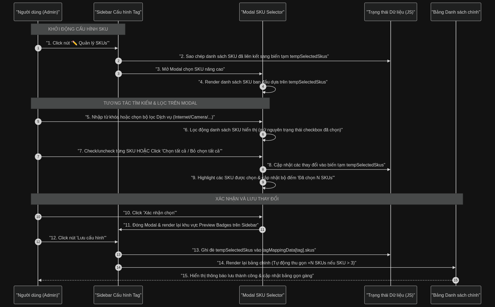
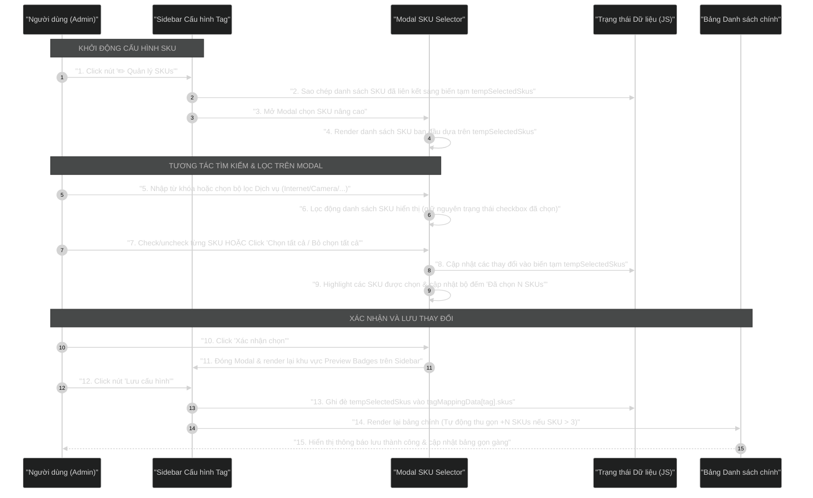

# Sơ đồ Sequence Diagram: Luồng Bộ chọn SKU nâng cao (Advanced SKU Selector)

Dưới đây là sơ đồ luồng hoạt động của bộ chọn SKU nâng cao khi người dùng cấu hình Tag Mapping trong trang CMS quản lý Thông tin hay. Thiết kế này giúp hệ thống xử lý mượt mà và trực quan ngay cả khi có hàng trăm hoặc hàng ngàn SKU sản phẩm.

## Mã nguồn Mermaid (Dùng để render ảnh)

## Giải thích luồng nghiệp vụ chi tiết

### 1. Khởi động và Khởi tạo trạng thái tạm thời
*   **Bước 1 - 2:** Khi người dùng bắt đầu chỉnh sửa danh sách SKU liên kết cho một Tag, hệ thống không cập nhật trực tiếp vào dữ liệu gốc mà sao chép danh sách SKU cũ sang một biến tạm `tempSelectedSkus`. Điều này giúp người dùng dễ dàng bấm "Hủy" mà không làm thay đổi dữ liệu hiện tại.
*   **Bước 3 - 4:** Modal chọn SKU mở ra và hiển thị danh sách SKU với trạng thái checkbox được check tương ứng dựa trên `tempSelectedSkus`.

### 2. Tìm kiếm, Lọc và Chọn hàng loạt
*   **Bước 5 - 6:** Khi danh sách SKU quá lớn, người dùng có thể tìm kiếm nhanh theo mã/tên SKU hoặc lọc theo phân loại (Internet, Camera, Truyền hình, Thiết bị). Việc lọc này chỉ ẩn/hiển thị các phần tử trên giao diện, không làm mất đi các SKU đã được chọn trước đó.
*   **Bước 7 - 9:** Người dùng có thể click chọn nhanh tất cả SKU đang hiển thị sau khi lọc. Biến tạm `tempSelectedSkus` được đồng bộ thời gian thực và cập nhật bộ đếm "Đã chọn N SKUs" trên tiêu đề modal.

### 3. Đồng bộ giao diện và Lưu cấu hình
*   **Bước 10 - 11:** Khi bấm "Xác nhận", modal đóng lại và danh sách SKU được hiển thị gọn gàng trên sidebar dưới dạng các Chips/Badges kèm nút xóa nhanh `x` để người dùng có thể loại bỏ nhanh SKU mà không cần mở lại modal.
*   **Bước 12 - 15:** Khi lưu cấu hình, dữ liệu chính thức được ghi nhận. Bảng danh sách tag mapping ở bên trái sẽ hiển thị danh sách SKU thu gọn: hiển thị tối đa 3 SKU đầu tiên, còn lại hiển thị badge số lượng `+N` kèm tooltip hiển thị toàn bộ danh sách khi rê chuột vào, giúp giao diện bảng luôn cân đối và không bị kéo giãn chiều cao dòng.
