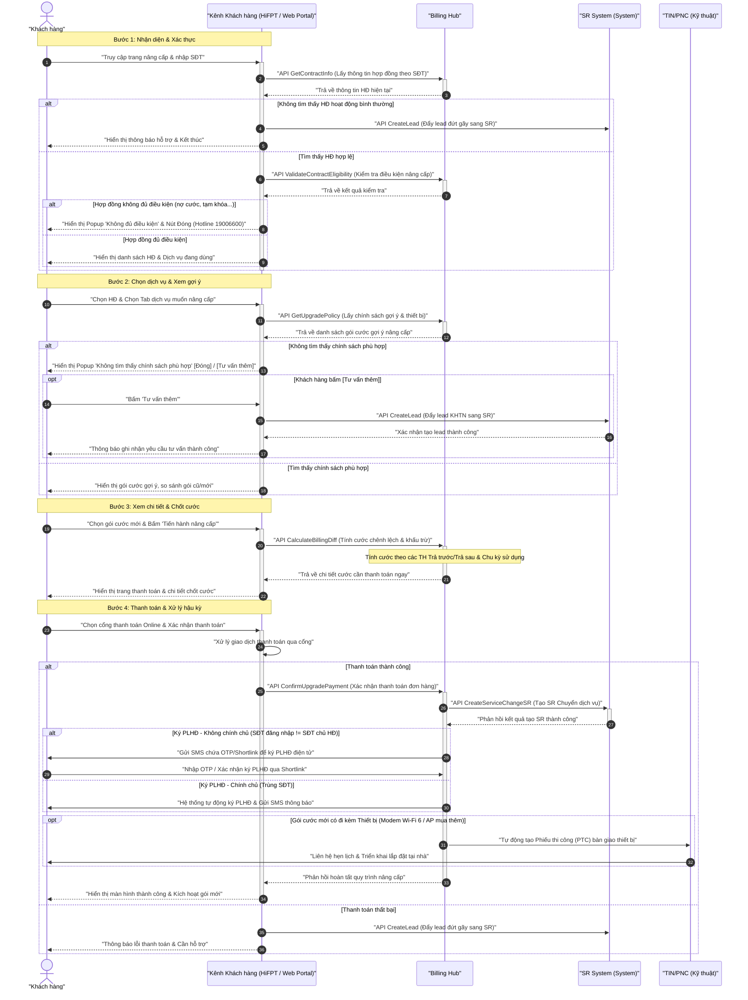

# Sơ đồ Sequence Diagram: Quy trình nâng cấp dịch vụ tự phục vụ (Self-service) ISC

Dưới đây là sơ đồ trực quan luồng nâng cấp dịch vụ tự phục vụ cho 5 nhóm dịch vụ chính (Internet, FPT Play, Camera, Combo, Ultra Fast).

## Bảng ký hiệu sử dụng trong sơ đồ

| Ký hiệu | Ý nghĩa |
|----------|---------|
| `participant` | Thành phần hệ thống (hộp chữ nhật) |
| `actor` | Người dùng bên ngoài (hình người) |
| `──▶` (`->>`) | Gọi đồng bộ (chờ phản hồi) |
| `╌╌▶` (`-->>`) | Phản hồi / Return |
| `──▷` (`-)`) | Gọi bất đồng bộ |
| `↻` (`A->>A`) | Tự gọi nội bộ |
| `▮ activate/deactivate` | Hộp kích hoạt (đang xử lý) |
| `alt/else/end` | Rẽ nhánh điều kiện |
| `opt/end` | Xử lý tùy chọn |
| `Note over` | Dải phân cảnh / Ghi chú |

## Giải thích luồng nghiệp vụ chi tiết

### 1. Phân đoạn 1: Xác thực & Lấy thông tin
*   **Bước 1 - 3**: Khách hàng cung cấp SĐT để hệ thống kiểm tra danh sách hợp đồng Billing đang liên kết. Billing Hub trả về thông tin hợp đồng cùng gói cước hiện tại.
*   **Bước 4 - 6**: Nếu không có HĐ hoạt động bình thường, hệ thống tự động lưu thông tin lead đứt gãy sang SR để nhân viên kinh doanh liên hệ hỗ trợ thủ công.
*   **Bước 7 - 10 (Edge Case từ HiFPT 9.5)**: Nếu tìm thấy HĐ hợp lệ, gọi API kiểm tra điều kiện nâng cấp. Trường hợp hợp đồng không đủ điều kiện (nợ cước, tạm khóa...), hiển thị popup cảnh báo là không đủ điều kiện nâng cấp.

### 2. Phân đoạn 2: Chọn dịch vụ & Gợi ý chính sách
*   **Bước 11 - 14**: Khách hàng lựa chọn hợp đồng và tab dịch vụ muốn nâng cấp. Billing Hub trả về danh sách chính sách gợi ý phù hợp dựa trên thuật toán gợi ý (gói cước đề xuất, thiết bị đi kèm).
*   **Bước 15 - 22**: Nếu không tìm thấy chính sách phù hợp, hệ thống hiển thị popup cho phép gửi yêu cầu tư vấn thêm (tạo lead sang SR). Nếu tìm thấy, hiển thị danh sách so sánh gói mới và gói cũ.

### 3. Phân đoạn 3: Chốt cước & Khấu trừ
*   **Bước 23 - 26**: Khi khách hàng đồng ý nâng cấp, Billing Hub thực hiện chốt cước tạm tính và tính toán chênh lệch. Số tiền chênh lệch sẽ được khấu trừ vào tài khoản trả trước hoặc tính dồn vào bill cuối tháng tùy thuộc vào hình thức thanh toán (Trả trước/Trả sau) của hợp đồng.

### 4. Phân đoạn 4: Thanh toán & Ký PLHĐ
*   **Bước 27 - 38**: Khách hàng thanh toán trực tuyến số tiền chốt cước (nếu có). Sau khi thành công, Billing Hub tạo SR chuyển dịch vụ để hệ thống kích hoạt tự động. Phụ lục hợp đồng được ký điện tử (tự động với chính chủ, qua SMS OTP/Shortlink với không chính chủ). Đối với các gói đi kèm Modem Wi-Fi 6 hoặc bộ phát AP, hệ thống tự động tạo phiếu thi công để kỹ thuật TIN/PNC bàn giao tại nhà.
